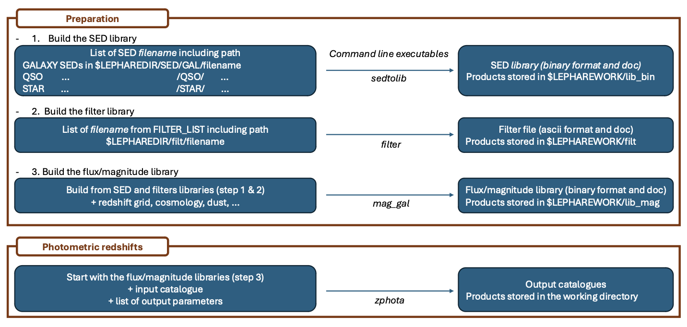

Detailed LePHARE user manual
============================

Introduction
-------------

This section contains details concerning the internal structure
of the code, meaning of keywords and how to run the code (with the python
interface and/or command lines).

The basic principle
^^^^^^^^^^^^^^^^^^^

*LePHARE* is a set of ``C++`` programs to compute photometric redshifts ( :math:`z_\mathrm{phot}` ) for galaxies and AGN, and galaxy physical parameters by fitting spectral energy distributions (SEDs) to a dataset of photometric fluxes or apparent magnitudes. Stellar templates are fitted too. The set of ``C++`` programs can also be manipulated as a library with python. The code can be run through notebooks or scripts, but also with command lines in the Unix shell as it was the case in previous versions of LePHARE in fortran. 

The photometric computation can be decomposed in four parts, as illustrated in :numref:`fig:skim`.

- a preliminary step to read the SED from synthetic models or observed spectra and build the SED library. This corresponds to the program ``sedtolib`` in command lines, and the class ``Sedtolib`` in python.

- a preliminary step to read the input filters used in the input photometric catalog and build the filter library. This corresponds to the program ``filter`` in command line, and the class ``Filter`` in python.

- a program to compute apparent magnitudes in the filter set for each template of the library, along a grid of redshifts, adding dust attenuation according to one or several laws, IGM opacity and nebular emission lines and storing the results. This step allows the user to extract basic information relative to the filters (e.g. :math:`\lambda_{mean}`, AB-corrections, attenuation) and SEDs (e.g. k-corrections, color-color diagrams, etc.). This corresponds to the program ``mag_gal`` in command line, and the class ``MagGal`` in python.
   
- The photometric redshift code based on a :math:`\chi^2` fitting method using the previously established libraries. This part can also be used to compute physical parameters. This corresponds to the program ``zphota`` in command line, and the class ``PhotoZ`` in python.

When running the code using command lines in your Unix shell, these four steps need to have been run at least once (but not everytime if the libraries already exist). When running the code using the python interface, the first three steps could be combined or atomized in smaller steps, but the basic principle of building the magnitude libraries before computing the photometric redshifts remain the same.
  

.. _fig:skim:

	  
  This figure present the four basic steps to run the code with command lines. The steps 1-2-3 could be compressed in a single one using the code "prepare" in python. 

   
Structure of the code
^^^^^^^^^^^^^^^^^^^^^

The structure of the package is illustrated in :ref:`Fig.2 <fig-structure>`.

The executables are stored in your default ``bin`` directory when installing the code using ``pip install``. They should be in your PATH and you shouldn't have to take care of that. If you want to know where the executables are located, try ``which setolib`` in your prompt.

If you have installed the code in developper mode, i.e. by cloning the code from the `lephare github repository <https://github.com/lephare-photoz/lephare>`_, the ``C++`` source codes are located in ``LEPHARE/src/lib/`` and the python scripts are in ``LEPHARE/src/lephare/``.

Two directories are essential for the functionning of the code:

- ``$LEPHAREDIR`` is the directory which contains the internal data used by *LePHARE*, as the filters, the SED templates, the dust attenuation curves, or the opacity of the IGM. If necessary, the user can add new data in this directory (e.g. new filters or new templates).

- ``$LEPHAREWORK`` is the directory which contains intermediate libraries created by *LePHARE*. The advantage is that these intermediate libraries don't need to be created every times you compute the photo-z if they already exist.

   
These two environment variables could be set in two different ways, depending on your need:

- Let the code set these environment variables by default (no action needed on your side). In such case, the code will identify your default ``cache`` directory. These directories are indicated in the notebook when excecuting  ``import lephare as lp`` in a notebook cell.

- Set yourself the values of these variables. ``$LEPHAREWORK`` could point to any directory you like (intermediate library will be stored inside).  ``$LEPHAREDIR`` should point to the LePHARE internal data directory (see below).

  Structure of the *LePHARE* repository.

The LePHARE internal data directory
^^^^^^^^^^^^^^^^^^^^^^^^^^^^^^^^^^^

The code needs essential information to run, like the filter curves or the SED templates. These informations are stored in one directory which is indicated by the ``$LEPHAREDIR`` environment variable. If the user doesn't set this variable, the code uses by default ``cache/lephare/data/``.

For a question of disk space and downloading time, the internal data are not installed by default. You have different methods to populate this directory:

- You can clone the full auxiliary data directory from `lephare-data github repository <https://github.com/lephare-photoz/lephare-data/>`_. In such case, the environment variable ``$LEPHAREDIR`` should be set to the ``LEPHARE-data`` directory path created by the cloning (not done automatically).

- You can retrieve all auxiliary data available in *LePHARE* immediatly, using the function ``lp.data_retrieval.get_auxiliary_data(clone=True)`` after having imported lephare as lp in python. You need 2Gb free to download these data. This function allows the user to download only the data needed for the run ``lp.data_retrieval.get_auxiliary_data(keymap=keymap, additional_files=["examples/COSMOS.in", "examples/output.para"])``, with ``keymap`` being the map of keywords used to configure the run. The code will check if the data are already stored before downloading them again.

The sub-directories in ``$LEPHAREDIR`` are the following:

- ``sed/`` which contains three sub-directories for galaxies ``GAL``, for Active Galaxy Nuclei ``QSO`` (named QSO for legacy reason), and for stars ``STAR``. Each of these subdirectory contains its own set of templates (the various directories should have a README file and a file named ``.list`` with a default list of templates).

- ``filt/`` contains subdirectories with telescope/instrument/survey names corresponding to a set of filters. A large number of filters are already included in the package. However, we propose also a solution when using the python interface to download the filters from a `Filter Profile Service <http://svo2.cab.inta-csic.es/theory/fps/>`_ with a much more extensive filter database.

- ``ext/`` includes several dust attenuation curves.

- ``opa/`` contains tables with the opacity of the intergalactic medium at various redshifts. The code uses by default the Madau et al. (1995) opacity. 

- ``vega/`` includes some spectra used for calibration (e.g. Vega to AB convertion).

- ``examples/`` includes some parameters files and input files which could be used as an example to run the photo-z on the COSMOS2020 catalogue (Weaver et al. 2022).
  

The user can add new data in this directory (e.g. if the user want to include a new set of templates not included in *LePHARE*) following the same model as other files already present in the sub-directories.

^^^^^^^^^^^

Running the code
----------------

Configuration files
^^^^^^^^^^^^^^^^^^^

Two configuration files (noted .para) allow the user to set up the properties of the template-fitting run, as well as the quantitites that the user want in output.

One configuration file set the parameters associated to the run (e.g., ``$LEPHAREDIR/example/COSMOS.para`` an example which contains all the keywords). It defines the set of templates, the filters and all the parameters that you want to tune to get the best results. You can save your parameter file where you want (e.g., in the directory where you run the code) to keep configuration files of different runs at any location. Configuration files must be in ASCII format, compliant with the following rules:

1.  Only one parameter per line, with the syntax: PARAMETER_NAME value(s)
2.  Comment line starts with “#”.
3.  Depending on the parameter, values can be Float, Integer, or String (without quotation marks).
4.  When a parameter accepts multiple values, these must be comma separated (no space).
5.  When a parameter accepts a file location (as a String), the path can include environmental variables (``$HOME`` and ``$LEPHAREDIR``).
6.  Some parameters are mandatory. *LePHARE* will print out an error message if they are not set.
7.  Other parameters can be omitted (*LePHARE* will assign a default value to them).

In the next sections, we will mark the mandatory parameters with an asterisk ("\*").

A second configuration file (e.g., ``$LEPHAREDIR/example/output.para``) indicates which properties should be written in the output file. The output.para includes all the possible output parameters. You can comment those that are of no intersest to you. 

Syntax
^^^^^^

with command lines
~~~~~~~~~~~~~~~~~~

All the programs in the suite can be run from a Unix shell with the following syntax:

.. code-block:: bash

  program -c config_file.para \
    -t G \ # type G for Galaxies / only necessary for sedtolib and mag_gal
    --Parameter value \ # optional flag to overwrite

where `program` is the name of the program (among ``filter``, ``sedtolib``, ``mag_gal``, ``zphota``), followed by a configuration file called with the ``-c`` option.

The various code options are defined in the configuration file but can also be given through additional instructions in the command line. Using such an optional list of parameters, any ``--Parameter value`` statement overrides the values in the configuration file. All the parameters are listed in the section :ref:`Keywords<allkeywords-label>`.

An extensive example on how to run the code with command lines and including some advanced features is available in this `example <https://github.com/lephare-photoz/lephare-data/blob/main/examples/README_full>`_.
 

with python
~~~~~~~~~~~

The ``C++`` programs can also be manipulated as a library using the python interface. This is done by importing the *LePHARE* library in the python scripts or notebooks:

.. code-block:: 

   import lephare as lp

Several notebooks are given in example in `here <https://github.com/lephare-photoz/lephare/blob/main/docs/notebooks/README.md>`_.

The `detailed run notebook <https://lephare.readthedocs.io/en/latest/notebooks/detailed_run.html>`_ is the closest to the four steps outlined in :numref:`fig:skim`, i.e. creating the filter library, the SED library, then build the predicted magnitudes from these filters and SEDs (for GAL/QSO/STAR), and finally running the photometric redshifts for a subsample of galaxies from COSMOS2020 having a spec-z.

However, we also added a function ``lp.prepare`` which first compute the full predicted magnitude library (the equivalent of combining filter, sedtolib, mag_gal together in the command lines), and then we compute the photometric redshifts with ``lp.process`` as in the example below and in this `typical run notebook <https://lephare.readthedocs.io/en/latest/notebooks/typical_run.html>`_.

.. code-block:: bash

  # Read the config file within the working directory		
  config = lp.read_config("your_config.para")
  # Example of change in the keywords
  config.update(
    {
        "FILTER_FILE": "filter_test",
        "Z_STEP": "0.05,0.,7.",
    }
  )
  # This line run together all the library preparation 
  lp.prepare(config)
  # Calculate the photometric redshifts
  output, pdfs = lp.process(config, input_table)

		

^^^^^^

.. _models:

Build the rest-frame templates library
--------------------------------------

Overview
^^^^^^^^

In this first step, we generate a unique binary file from different kinds of SEDs (star/AGN/galaxy) with various original formats (ASCII, binary). The binary output file (\*.bin) is saved in the directory ``$LEPHAREWORK/lib_bin/`` with an attached doc file (\*.doc). An associated file with physical information (\*.phys) is provided only for galaxies (not calibrated or not relevant for stars or AGN). For models with input SEDs expressed in luminosity or energy (:math:`L_{\odot}/A`,\ :math:`\nu L_{\nu}`,...), like BC03, or the FIR libraries, the SED are converted in flux (:math:`erg/s/cm^2/A`).

A set of libraries for stars, galaxies, and AGN are available in $LEPHAREDIR/sed/STAR, $LEPHAREDIR/sed/GAL, $LEPHAREDIR/sed/QSO directories and organized in different sub-folders. Each sub-folder contains a specific collection of SED files, described in a README (how those SEDs were built, etc.), and a file (usually with the suffix ``.list``) listing the relative path of the SED files to be used as input to create the libeary. For STAR and QSO and most of the galaxies, SEDs are written in ASCII, with :math:`\lambda(A)`, flux[:math:`erg/s/A/cm^2`], with increasing :math:`\lambda`. For Galaxy, in addition to empirical SEDs, output files from stellar synthesis population models (BC03) with a more complex format can also be used by adding a specific character *BC03* after the file name in the SED list file. Here are two examples of lists with the 
`BC03 templates <https://github.com/lephare-photoz/lephare-data/blob/main/sed/GAL/BC03_CHAB/BC03COMB_MOD.list>`_  used in Ilbert et al. (2015) and the 
`COSMOS templates <https://github.com/lephare-photoz/lephare-data/blob/main/sed/GAL/COSMOS_SED/COSMOS_MOD.list>`_ used in Ilbert et al. (2009)

Syntax
^^^^^^

with command lines
~~~~~~~~~~~~~~~~~~

The program **sedtolib** is used to build the different STAR, QSO and GAL libraries from a list of SED files. 

Specific parameters have been duplicated for the STAR, QSO, and GAL categories with different names to simplify this algorithm section. The option -t allows you to specify if galaxy (G), star (S), or QSO (Q) parameters have to be read.
The syntax is

.. code-block:: bash

  sedtolib -c config_file.para  -t G [or Q or S]

with python
~~~~~~~~~~~

With the python, you need to instantiate an object from the class ``Sedtolib``, and indicate the type of SEDs (GAL/QSO/STAR) when applying the function ``run``.

.. code-block:: python

  sedlib = lp.Sedtolib(config_keymap=keymap)
  sedlib.run(typ="STAR", star_sed="$LEPHAREDIR/sed/STAR/STAR_MOD_ALL.list")

  

Parameter values
^^^^^^^^^^^^^^^^

The parameter value "XXX" means either GAL or QSO or STAR.
  
 
+-------------+--------+---------+----------------------------------+
| parameter   | type   | default | description                      |
+=============+========+=========+==================================+
| XXX_SED(\*) | string | —-      | Full pathname of file with the   |
|             |        |         | list of selected SED files       |
|             | (n=1)  |         |                                  |
+-------------+--------+---------+----------------------------------+
| XXX_LIB(\*) | string | —-      | Name of the output binary        |
|             |        |         | library (with no extension).     |
|             | (n=1)  |         | Files *$XXX_LIB*.bin,            |
|             |        |         | *$XXX_LIB*.doc and               |
|             |        |         | *$XXX_LIB*.phys                  |
|             |        |         | saved in                         |
|             |        |         | $\ *LEPHAREWORK*/lib_bin/        |
+-------------+--------+---------+----------------------------------+
| XXX_FSCALE  | float  | 1.0     | Flux scale to be applied to each |
|             |        |         | SED in the list                  |
|             | (n=1)  |         |                                  |
+-------------+--------+---------+----------------------------------+
| SEL_AGE     | string | NONE    | Full pathname of file with a     |
|             |        |         | list of ages (Gyr)               |
|             | (n=1)  |         | to be extracted.                 |
|             |        |         | Only when using templates        |
|             |        |         | including an age (e.g. BC03).    |
+-------------+--------+---------+----------------------------------+
| AGE_RANGE   | float  | —–      | Range of age (Gyr).              |
|             | (n=2)  |         | Only when using templates        |
|             |        |         | including an age (e.g. BC03).    |
+-------------+--------+---------+----------------------------------+

Adding new templates
^^^^^^^^^^^^^^^^^^^^

New SEDs can be easily added to the current ones. They must be located
in the appropriate directory (GAL/STAR/QSO) and we also advice to create a subdirectory. If they are ASCII files
they must be in :math:`\lambda(A)`, flux[:math:`erg/s/A/cm^2`], with increasing :math:`\lambda`.

Output
^^^^^^

The binary output file (\*.bin) is saved in the directory ``$LEPHAREWORK/lib_bin/`` with an attached doc file (\*.doc) and a file with physical information (\*.phys) for galaxies. 

Others
^^^^^^

Already included libraries
~~~~~~~~~~~~~~~~~~~~~~~~~~

The easiest is to take a predefined list of SED in the existing subdirectories and look at the README file.

For stars *($LEPHAREDIR/sed/STAR)*, SEDs are available in the subdirectories :

- PICKLES/: 131 stellar SEDs from Pickles (1998)
- BD/: Low mass stars library from Chabrier et al. (2000)
- BD_NEW/: Brown dwarfs library from Baraffe et al. 2015, Morley et al. 2012, 2014
- LAGET/: (missing REF)
- WD/: 4 white dwarfs from Bohlin et al. (1995)
- SPEC_PHOT: Spectro-Photometric standards from Hamuy et al. (1992, 1994)

For AGN *($LEPHAREDIR/sed/QSO)*, there is a list of observed spectra from different authors and some synthetical AGN listed in the subdirectory. In particular, a list of templates was successfully used for computing the photometric redshift of the *XMM* and *Chandra* AGN identified in COSMOS. In short, the library includes pure QSO and hybrid templates obtained by combining galaxies with various AGN and QSO templates with different relative ratios. The details of the template construction are outlined in Salvato et al. (2009). Note that, unlike for galaxies, the templates to be used in QSO depend on the type of AGN and QSO to be fitted (see Salvato et al 2011, Fotopoulou et al. 2012, Hsu et al. 2014, Ananna et al. 2017)

For galaxies *($LEPHAREDIR/sed/GAL)*, SEDs are available in the following subdirectories:

- CFHTLS_SED/: 66 SEDs used for CFHTLS photo-z paper (Arnouts et al. 2007)
- COSMOS_SED/: 31 SEDs used for COSMOS photo-z paper (Ilbert et al. 2009, 2013, Salvato et al. 2011, Dahlen et al. 2013)
- CWW_KINNEY/: original CWW and Kinney spectra
- BC03_CHAB/: SEDs from the BC03 library. These templates are derived with exponentially declining Star Formation Histories.
- BC03_CHAB_DELAYED/: SEDs from the BC03 library. These templates are derived with delayed Star Formation Histories.

For Far-Infrared (FIR) SEDs *($LEPHAREDIR/sed/GAL)*, different SEDs are available :

- CHARY_ELBAZ/: 105 FIR templates for different luminosity
- DALE/ : 64 FIR templates
- LAGACHE/: 46 FIR templates
- SK06/ : different set of starburst models based on Siebenmorgen &Krugel (2006)

  .. note::
     Note that for the first 3 libraries (CHARY-ELBAZ, DALE, LAGACHE), we have subtracted a stellar component from their SEDs to get only the dust contribution at the shortest wavelengths.

To know the format of the SEDs that are used in your list, an additional character must be specified after each SED file, allowing you to mix in one list of different types of galaxy SEDs. For example, you could prepare a new list which includes:

| BC03_CHAB/bc2003_lr_m52_chab_tau03_dust00.ised_ASCII BC03
| BC03_CHAB/bc2003_lr_m62_chab_tau03_dust00.ised_ASCII BC03
| COSMOS_SED/Ell1_A_0.sed
| COSMOS_SED/Ell2_A_0.sed

In each list, it is possible to comment out a template with #.
For ASCII SED file, no character is required. The character BC03 is used for the Bruzual and Charlot 2003 models. For the BC03 templates, the files are in ASCII for the C++ version of LePhare, to avoid the problem of portability between various systems.

For the list with FIR SEDs, the character LW (as for Long Wavelength) is required, with an example for Chary and Elbaz (2001)
`templates list <https://github.com/lephare-photoz/lephare-data/blob/main/sed/GAL/CHARY_ELBAZ/CHARY_ELBAZ.list>`_.

Find physical information associated to the library
~~~~~~~~~~~~~~~~~~~~~~~~~~~~~~~~~~~~~~~~~~~~~~~~~~~

For the galaxy templates, an additional file is generated associated to the library. The file ``$LEPHAREWORK/lib_bin/*.phys`` contains the following parameters:

| Model Age :math:`L_{UV}` :math:`L_R` :math:`L_K` :math:`L_{IR}` Mass SFR Metallicity Tau :math:`D_{4000}`

| where
| Age is expressed in yr
| :math:`L_{UV}` is near-ultraviolet monochromatic luminosity (Log([erg/s/Hz])) (:math:`\int_{2100}^{2500} L_{\lambda} d\lambda /400 * 2300^2/c` ))
| :math:`L_R` is optical r monochromatic luminosity (Log([erg/s/Hz]))  (:math:`\int_{5500}^{6500} L_{\lambda} d\lambda /1000 * 6000^2/c` ))
| :math:`L_K` is near-infrared K monochromatic luminosity (Log([erg/s/Hz]))  (:math:`\int_{21000}^{23000} L_{\lambda} d\lambda /2000 * 22000^2/c`  ))
| :math:`L_{IR}` is the infrared luminosity (Log([:math:`L_{\odot}`]))
| Mass is the stellar mass (:math:`M_{\odot}`), .i.e. the mass truly in  stars (not the integral of the SFH)
| SFR is the ongoing star formation rate (:math:`M_{\odot}/yr`)
| Metallicity is the Gas metallicity of the galaxy
| Tau is the e-folding parameter for a star formation history with  SFH=exp(-t/tau) (yr)
| :math:`D_{4000}` is the 4000A break measured as in Bruzual 1983 (:math:`D_{4000}= \int_{4050}^{4250} F_{\lambda} d\lambda / \int_{3750}^{3950} F_{\lambda} d\lambda`)

| If not available, the parameters are set to -99.

| The IR luminosity (:math:`L_{IR}`) is derived using LW libraries (LW for Long Wavelengtgh to describe the dust emission). For  the Infra-red libraries ( LW: Dale, Lagache, Chary-Elbaz, Siebenmorgen  & Krugel) the IR luminosity is measured from 8 to 1000 microns. These  luminosities may be slightly different then the ones quoted by the  authors due to the different definitions of the :math:`L_{IR}` integration limit and because (at least for Dale, Lagache, and  Chary-Elbaz) we have subtracted the underlying stellar component from the original SEDs.

^^^^^^^^^^^

   
.. _sec:filter:

Build the filter library
------------------------

Overview
^^^^^^^^

The goal of this step is to:

- read a list of filter, corresponding to the ones used in your input catalogue;
  
- read each of these filters and convert them into a common format;

- store them in a common library in ``$LEPHAREWORK/filt/``.

  
Several sets of filters from different telescopes/instruments are available in the directory ``$LEPHAREDIR/filt/``. You could find in this directory most of the standard filters (like the Johnson-Kron-Cousins in ``filt/jkc``). In order to know the existing filters in lephare-data, the simplest is to look at https://github.com/lephare-photoz/lephare-data/tree/main/filt, or the directory lephare-data if everything was cloned. The filters  will be downloaded automatically if a clone of the full lephare-data wasn't done.

You could also store new filters in another directory than ``$LEPHAREDIR/filt/`` using the keyword ``FILTER_REP``.

Syntax
^^^^^^

with command lines
~~~~~~~~~~~~~~~~~~

The program ``filter`` puts together a list of filter response curves, and applies some transformations according to the nature of the filters as define in the configuration file. 
  
.. code-block:: bash

  filter -c config_file.para

The resulting file is placed in the directory ``$LEPHAREWORK/filt/``.

with python
~~~~~~~~~~~

With the python interface, you need to instantiate an object from the class ``Filter``, and apply the function ``run``.

.. code-block:: python

  filterLib = lp.Filter(config_file=config_file)
  filterLib.run()

  

  
Parameter descriptions
^^^^^^^^^^^^^^^^^^^^^^

+----------------+----------------+---------------------+--------------------+
| Parameters     | type           | default             | description        |
+================+================+=====================+====================+
| FILTER_REP     | string         | $LEPHAREDIR/filt/   | Name of the        |
|                |                |                     | repository         |
|                |                |                     | containing the     |
|                |                |                     | filters.           |
|                | (n=1)          |                     |                    |
|                |                |                     |                    |
+----------------+----------------+---------------------+--------------------+
| FILTER_LIST    | string         | —-                  | filter files       |
|                |                |                     | separated by a     |
|                |                |                     | comma. Keep the    |
|                |                |                     | same order as in   |
|                |                |                     | the input          |
|                |                |                     | photometric        |
|                |                |                     | catalogue.         |
|                | Nfilt not      |                     |                    |
|                | limited        |                     |                    |
+----------------+----------------+---------------------+--------------------+
| TRANS_TYPE     | float          | 0                   | Filter             |
|                |                |                     | transmission       |
|                |                |                     | type: 0=           |
|                |                |                     | Energy; 1=         |
|                |                |                     | Photon             |
|                | n=1 or n=Nfilt |                     |                    |
+----------------+----------------+---------------------+--------------------+
| FILTER_CALIB   | integer        | 0                   | Filter             |
|                |                |                     | calibration        |
|                |                |                     | for long           |
|                |                |                     | wavelengths        |
|                |                |                     | [0-def].           |
|                | n=1 or n=Nfilt |                     | Could use a value  |
|                |                |                     | per filter         |
|                |                |                     | separated          |
|                |                |                     | with coma.         |
+----------------+----------------+---------------------+--------------------+
| FILTER_FILE    | string         | filter              | Name of the output |
|                |                |                     | file with all      |
|                |                |                     | combined           |
|                |                |                     | filters .          |
|                | (n=1)          |                     | It is saved in     |
|                |                |                     | $LEPHAREWORK/filt/ |
|                |                |                     |                    |
+----------------+----------------+---------------------+--------------------+

``FILTER_LIST``: all the filter names must be separated by a comma. We assume that all the filter files are located in the directory ``$LEPHAREDIR/filt/``, except if the keyword ``FILTER_REP`` is specified. When writing the set of filters to be used, only the pathname after the common string ``$LEPHAREDIR/filt/`` should be specified.
  
``TRANS_TYPE``: type of the transmission curve for each filter, separated by a comma. The number of arguments should match the number of filter, unless only one is given. In that case it will be used for all filters. The transmissions (:math:`T_{\lambda}`) are dimensionless (in % ), however they refer either to a transmission in Energy or Photon which will slightly modify the magnitude estimates. The magnitude is :

  .. math:: mag(*) = -2.5 \log_{10} \frac{\int F_{\lambda}(*) R_{\lambda} d\lambda}{\int F_{\lambda}(Vega) R_{\lambda} d\lambda}

If the transmission curve (:math:`T_{\lambda}`) corresponds to energy then :math:`R_{\lambda}=T_{\lambda}`.
If the transmission curve (:math:`T_{\lambda}`) corresponds to number of photons (:math:`N_{\varphi}`) then
:math:`R_{\lambda}= \lambda T_{\lambda}` :

  .. math::

     N_{\varphi} =  \frac{ F_{\lambda} d\lambda }{h\ \nu} = \frac{F_{\lambda} \lambda d\lambda }{h\ c} \rightarrow  
      mag(*)=-2.5 \log_{10} \frac{\int F_{\lambda}(*) \lambda T_{\lambda} d\lambda}{\int F_{\lambda}(Vega) \lambda T_{\lambda} d\lambda}  \rightarrow  R_{\lambda}=\lambda T_{\lambda}

When building the filter library, the filter shape is changed with respect to the original one as follows :

  .. math:: R_{\lambda}=T_{\lambda} ( \frac{\lambda}{< \lambda >})^{tt}

where :math:`tt` is the value of ``TRANS_TYPE`` parameter and :math:`< \lambda >` is the mean wavelength of the filter.
The modification of filter shape can be significant for long wavelength filters and when the filter is broad. Nevertheless it is often not the dominant source of errors with respect to other uncertainties relative to QE-CCD, telescope transmission, atmospheric extinction shape etc...

In the output filter file specified by the keyword ``FILTER_FILE``, we save the values (:math:`\lambda (A)`,\ :math:`R_{\lambda}`).

``FILTER_CALIB``: This keyword allow to consider specific calibrations at long wavelengths in order to apply a correction factor to the original flux estimated by LEPHARE. We define the correction factor as fac_corr\ :math:`=\frac{\int  R_{\nu} d\nu}{\int \frac{B_{\nu}}{B_{\nu_0}} R_{\nu} d\nu}= \frac{\int  R_{\lambda} d\lambda/\lambda^2}{1/\lambda_0^2 \int \frac{B_{\lambda}}{B_{\lambda_0}} R_{\lambda} d\lambda}`, where :math:`B_{\nu}` is the reference spectrum used to calibrate the filters and :math:`\lambda_0` is the effective wavelength defined as :math:`\lambda_{0}= \frac{\int R_{\lambda} B_{\lambda} \lambda d\lambda}{\int R_{\lambda}  B_{\lambda}  d\lambda}`. The value of ``FILTER_CALIB`` allows to describe different combinations of :math:`\nu_0` and :math:`B_{\nu}`:

| ``FILTER_CALIB=0`` :math:`\frac{B_{\nu}}{B_{\nu_0}}=1` or :math:`B_{\nu}=ctt`. This is the default value used in *LePHARE*.
| ``FILTER_CALIB=1`` :math:`\nu B_{\nu}=ctt`. This describes the SPITZER/IRAC, ISO calibrations.
| ``FILTER_CALIB=2`` :math:`B_{\nu}=\nu`. This describes the sub-mm calibrations.
| ``FILTER_CALIB=3`` :math:`B_{\nu}=`\ black body at T=10,000K.
| ``FILTER_CALIB=4`` : A mix calibration with :math:`\nu_0` defined from :math:`\nu B_{\nu}=ctt` and the flux estimated as :math:`B_{\nu}=`\ black body at T=10,000K. This appears to be the adopted scheme for the SPITZER/MIPS calibration.
| ``FILTER_CALIB=5`` : Similar mix calibration with :math:`\nu_0` defined from :math:`\nu B_{\nu}=ctt` and the flux estimated as :math:`B_{\nu}=\nu`. This may reflect the SCUBA calibration.

  
Adding a new filter
^^^^^^^^^^^^^^^^^^^

In general
~~~~~~~~~~

Filters are ASCII files with the following format :
| In first row : #   SHORT_NAME_of_FILTER      ADD_COMMENTS
| In next rows : :math:`\lambda (A)` Transmission

Wavelengths must be in increasing order. It is better to put the lowest and highest :math:`\lambda` with Transmission=0. The units of transmission are not considered.

The header, the transmission at 0 on the edges, and the transmission sorted in lambda are set internally if not prepared by the user.

As an exemple : filter pippo.pb and put it in $LEPHAREDIR/filt/pippo/pippo.pb :

======= ================================
# PIPPO This is close to window function
5000    0
5001    1
5999    1
6000    0
======= ================================

The user should avoid setting a resolution that is unnecessarily high, as this could result in expensive computational time for the predicted magnitude library.

Getting new filter automatically (only in python)
~~~~~~~~~~~~~~~~~~~~~~~~~~~~~~~~~~~~~~~~~~~~~~~~~

The python interface allows to load the filters from a yml file, with the possibility to query the `SVO service <http://svo2.cab.inta-csic.es/theory/fps/>`_ including a much larger number of filters.

.. code-block:: python

  filterLibSVO = lp.FilterSvc.from_yaml(f"{lp.LEPHAREDIR}/examples/config_svo_filters.yml")
  filter_output = os.path.join(os.environ["LEPHAREWORK"], "filt", keymap["FILTER_FILE"].value)
  lp.write_output_filter(filter_output + "_svo.dat", filter_output + "_svo.doc", filterLibSVO)

where ``$LEPHAREDIR/examples/config_svo_filters.yml`` is a yml file including the name of filters to be downloaded. You can copy the yaml file into your own directory and modify the names of the filters according to the ones in the SVO website. The transmission type is given in the SVO webpage. The filters will be stored in ``LEPHAREWORK/filt/`` and name defined according to the keyword ``FILTER_FILE``.

Output
^^^^^^

The filters are stored in a single ascii file as given by ``FILTER_FILE`` and store in ``$LEPHAREWORK/filt/`` with an attached doc file (\*.doc).

Additionnal features
^^^^^^^^^^^^^^^^^^^^

Get information on the filters
~~~~~~~~~~~~~~~~~~~~~~~~~~~~~~

As an example, using default values listed in the configuration file zphot.para.

+--------------+------------------------------------------------------+
| FILTER_LIST  | tmp/f300.pb,tmp/f450.pb,                             |
|              | tmp/f606.pb,tmp/f814.pb,tmp/Jbb.pb,tmp/H.pb,tmp/K.pb |
+--------------+------------------------------------------------------+
| TRANS_TYPE   | 0                                                    |
+--------------+------------------------------------------------------+
| FILTER_CALIB | 0                                                    |
+--------------+------------------------------------------------------+
| FILTER_FILE  | HDF.filt                                             |
+--------------+------------------------------------------------------+
|              |                                                      |
+--------------+------------------------------------------------------+

When building the filter library, the following informations are written on the screen :

+-------+----+-------------------------------+-----------------------------+-------------+-------------+-------------+-------------+---------------------------+-----+---------------------------+-------+
| #NAME | ID | :math:`\lambda_{eff}^{mean}`  | :math:`\lambda_{eff}^{Vega}`| FWHM        | ABcor       | TGcor       | VEGA        | :math:`M_{\odot}^{AB}`    | CAL |     :math:`\lambda_{0}`   | Fac   |
|       |    |                               |                             |             |             |             |             |                           |     |                           |       |
+-------+----+-------------------------------+-----------------------------+-------------+-------------+-------------+-------------+---------------------------+-----+---------------------------+-------+
| F300W | 1  | 0.2999                        | 0.2993                      | 0.0864      | 1.398       | 99.99       | -21.152     | 7.433                     | 0   | 0.2999                    | 1.000 |
|       |    |                               |                             |             |             |             |             |                           |     |                           |       |
+-------+----+-------------------------------+-----------------------------+-------------+-------------+-------------+-------------+---------------------------+-----+---------------------------+-------+
| F450W | 2  | 0.4573                        | 0.4513                      | 0.1077      | -0.074      | -0.339      | -20.609     | 5.255                     | 0   | 0.4573                    | 1.000 |
|       |    |                               |                             |             |             |             |             |                           |     |                           |       |
+-------+----+-------------------------------+-----------------------------+-------------+-------------+-------------+-------------+---------------------------+-----+---------------------------+-------+
| F606W | 3  | 0.6028                        | 0.5827                      | 0.2034      | 0.095       | 0.161       | -21.367     | 4.720                     | 0   | 0.6028                    | 1.000 |
|       |    |                               |                             |             |             |             |             |                           |     |                           |       |
+-------+----+-------------------------------+-----------------------------+-------------+-------------+-------------+-------------+---------------------------+-----+---------------------------+-------+
| F814W | 4  | 0.8013                        | 0.7864                      | 0.1373      | 0.417       | 0.641       | -22.322     | 4.529                     | 0   | 0.8013                    | 1.000 |
|       |    |                               |                             |             |             |             |             |                           |     |                           |       |
+-------+----+-------------------------------+-----------------------------+-------------+-------------+-------------+-------------+---------------------------+-----+---------------------------+-------+
| Jbb   | 5  | 1.2370                        | 1.2212                      | 0.2065      | 0.890       | 99.99       | -23.748     | 4.559                     | 0   | 1.2370                    | 1.000 |
|       |    |                               |                             |             |             |             |             |                           |     |                           |       |
+-------+----+-------------------------------+-----------------------------+-------------+-------------+-------------+-------------+---------------------------+-----+---------------------------+-------+
| H     | 6  | 1.6460                        | 1.6252                      | 0.3377      | 1.361       | 99.99       | -24.839     | 4.702                     | 0   | 1.6460                    | 1.000 |
|       |    |                               |                             |             |             |             |             |                           |     |                           |       |
+-------+----+-------------------------------+-----------------------------+-------------+-------------+-------------+-------------+---------------------------+-----+---------------------------+-------+
| K     | 7  | 2.2210                        | 2.1971                      | 0.3967      | 1.881       | 99.99       | -26.012     | 5.178                     | 0   | 2.2210                    | 1.000 |
|       |    |                               |                             |             |             |             |             |                           |     |                           |       |
+-------+----+-------------------------------+-----------------------------+-------------+-------------+-------------+-------------+---------------------------+-----+---------------------------+-------+

| 
| where :
| Col 1 : Name put in the first row of the filter file
| Col 2 : incremental number
| Col 3 : Mean wavelength (:math:`\mu m`) : :math:`\int R_{\lambda} \lambda d\lambda / \int R_{\lambda} d\lambda`
| Col 4 : Effective wavelength with Vega (:math:`\mu m`) : :math:`\int R_{\lambda} F_{\lambda}(Vega)\lambda d\lambda / \int R_{\lambda}F_{\lambda}(Vega) d\lambda`
| Col 5 : Full Width at Half of Maximum (:math:`\mu m`)
| Col 6 : AB Correction where :math:`m_{AB} = m_{VEGA} + ABcor`
| Col 7 : Thuan Gunn correction where :math:`m_{TG} = m_{VEGA} + TGcor`. (99.99 if undefined)
| Col 8 : VEGA magnitude : :math:`2.5\log_{10}(\int R_{\lambda} F_{\lambda}(Vega) d\lambda / \int R_{\lambda} d\lambda`)
| Col 9 : AB absolute magnitude of the sun (:math:`M^{AB}_{\nu,\odot}`)
| Col 10: value of the calibration used for (:math:`B_{\nu}/B_{\nu_0}`,\ :math:`\nu_0`) in ``FILTER_CALIB``
| Col 11: Effective wavelength (:math:`\mu m`) :math:`\lambda_{0}^{B_{\nu}}= \frac{\int R_{\lambda} B_{\lambda} \lambda d\lambda}{\int R_{\lambda}  B_{\lambda}  d\lambda}`.
| Col 12: Correction factor to be applied to the original flux measured by LEPHARE. This correction is included in the programs **mag_gal** and **mag_star** as :math:`flux^{cor}= flux^{LePhare}\times`\ fac_cor

Extinction informations
~~~~~~~~~~~~~~~~~~~~~~~

| The stand alone program (**filter_extinc**) returns information about
  atmospheric extinctions and galactic extinctions.
| A set of atmospheric extinction curves and galactic extinction laws
  are available in $LEPHAREDIR/ext/ directory. It includes Calzetti and
  Prevot extinction laws. The Cardelli law is hardcoded in the programs
  and is the default law for the galactic extinction.
| % **filter_extinc** -c COSMOS.para -FILTER_FILE filter_test.dat
| It returns:
| # Computing ATMOSPHERIC AND GALACTIC EXTINCTIONS
| # with the following options:

=============================== =================
# Filters:                      filter_extinc.dat
# Atmospheric extinction curve: extinc_etc.dat
# Galactic extinction curve:    CARDELLI
# Output file:                  filter_extinc.dat
=============================== =================

| 

====================== ================ ======== ============
Filters                Ext(mag/airmass) Albda/Av Albda/E(B-V)
cosmos/u_cfht          0.486            1.504    4.663
cosmos/B_subaru        0.264            1.297    4.020
cosmos/V_subaru        0.141            1.006    3.118
cosmos/r_subaru        0.096            0.858    2.659
cosmos/i_subaru        0.052            0.643    1.992
cosmos/suprime_FDCCD_z 0.027            0.471    1.461
vista/Y                0.049            0.391    1.211
vista/J                0.096            0.281    0.871
vista/H                0.100            0.181    0.562
vista/K                0.100            0.118    0.364
====================== ================ ======== ============

| 
| Col 2 : Mean atmospheric extinction (mag/airmass) using (EXT_CURVE):
  :math:`A_{\lambda}= \int R_{\lambda} Ext(\lambda) d\lambda / \int R_{\lambda} d\lambda`
| :math:`Ext(\lambda)` comes from any atmospheric extinction curve that
  is put in $\ *LEPHAREDIR*/ext/.
| Col 3 : Mean galactic attenuation (in :math:`A(\lambda)/A_V`) using
  the galactic extinction law (GAL_CURVE). Col 4 : Mean galactic
  attenuation (in :math:`A(\lambda)//E(B-V)`) as a function of color
  excess (E(B-V)) assuming :math:`A_V=R_V\times E(B-V)`.
| For :math:`R_V` coefficients, we assume :math:`R_V=3.1` for most
  extinction laws but Calzetti (:math:`R_V=4.05`) and Prevost
  (:math:`R_V=2.72`).
| Others extinction laws can be added by following the format
  (:math:`\lambda(A) , k_{\lambda}`).

	  
.. _`sec:filtcalib`:

Application to long wavelengths 
~~~~~~~~~~~~~~~~~~~~~~~~~~~~~~~~

*LePHARE* has been developped for the optical-NIR domain but can be used
at shorter (UV) and longer wavelengths (FIR, submm and radio). In
particular extensive tests have been performed in the long wavelength
domain by E. Le Floc’h to evaluate the photometric accuracy. Some issues
have to be considered :

-  the Vega spectrum is not defined at :math:`\lambda\ge 160\mu m`.
   Thus, the AB magnitude system should be used as standard when combining a large wavelength domain.

-  The bandpass in radio domain is very narrow and does not require to
   convolve through the filter. However the structure of *LePHARE*
   requires to implement a transmission curves for the radio frequencies
   in similar way as in shorter wavelengths.

More important, at long wavelengths the equivalent fluxes are taken as
the monochromatic flux density calculated at the effective wavelength of
the filter and for a reference spectrum that would result in the same
energy received on the detector:

.. math:: <F_{\nu}> = \frac{\int F_{\nu} R_{\nu} d\nu}{\int \frac{B_{\nu}}{B_{\nu_0}} R_{\nu} d\nu}

where :math:`B_\nu` is the reference spectrum and :math:`\nu_0` the
effective frequency of the filter. In LePHARE, the flux estimates are
equivalent to consider :math:`\frac{B_{\nu}}{B_{\nu_0}}=1`
(:math:`B_{\nu}=ctt`). Therefore there is a correction factor to account
for with respect to the original flux estimated by LePHARE. This
correction is :

.. math:: <F_{\nu}>^{COR} = <F_{\nu}>^{LePhare} \times \frac{\int R_{\nu} d\nu}{\int \frac{B_{\nu}}{B_{\nu_0}} R_{\nu} d\nu}

| At long wavelengths, different conventions have been used for the
  reference spectrum. As an example: SPITZER/IRAC uses a flat spectrum
  (:math:`\nu B_{\nu}=ctt`) as well as ISO; SPITZER/MIPS uses a
  blackbody with temperature T=10000K while SCUBA uses planets which
  have SEDs in submillimeter very close to :math:`B_{\nu}=\nu`. The
  keyword FILTER_CALIB is used to account for these different
  calibration scheme (see :ref:`sec:filter`).
| One additional effect is the way the effective wavelength is defined.
  In the case of MIPS, the effective wavelength seems to be defined,
  according to the MIPS handbook, as :math:`\nu B_{\nu}=ctt` while the
  reference spectrum is a black body. This mix definition can be
  described with FILTER_CALIB=4.
| In the table below we report the effective wavelengths and the
  correction factors that are applied to LEPHARE fluxes for a set of
  filters spanning from NIR (K band), MIR (SPITZER/IRAC), FIR
  (SPITZER/MIPS), sub-mm (SCUBA) to radio (VLA: 1.4GHz).

+------------+------------------------+-------------------------+-----+--------------------------------+-------+-----+-------------------------------+-------+
| #NAME      | :math:`\lambda_{mean}` | :math:`M_{\odot}^{AB}`  | CAL | :math:`\lambda_{0}^{B_{\nu}}`  | Fac   | CAL | :math:`\lambda_{0}^{B_{\nu}}` | Fac   |
|            |                        |                         |     |                                |       |     |                               |       |
|            |                        |                         |     |                                |       |     |                               |       |
|            |                        |                         |     |                                |       |     |                               |       |
|            |                        |                         |     |                                |       |     |                               |       |
|            |                        |                         |     |                                |       |     |                               |       |
+============+========================+=========================+=====+================================+=======+=====+===============================+=======+
| K          | 2.2210                 | 5.178                   | 0   | 2.2210                         | 1.000 | 0   | 2.2210                        | 1.000 |
|            |                        |                         |     |                                |       |     |                               |       |
+------------+------------------------+-------------------------+-----+--------------------------------+-------+-----+-------------------------------+-------+
| IRAC_1     | 3.5634                 | 6.061                   | 1   | 3.5504                         | 1.004 | 1   | 3.5504                        | 1.004 |
|            |                        |                         |     |                                |       |     |                               |       |
+------------+------------------------+-------------------------+-----+--------------------------------+-------+-----+-------------------------------+-------+
| IRAC_2     | 4.5110                 | 6.559                   | 1   | 4.4930                         | 1.004 | 1   | 4.4930                        | 1.004 |
|            |                        |                         |     |                                |       |     |                               |       |
+------------+------------------------+-------------------------+-----+--------------------------------+-------+-----+-------------------------------+-------+
| IRAC_3     | 5.7593                 | 7.038                   | 1   | 5.7308                         | 1.005 | 1   | 5.7308                        | 1.005 |
|            |                        |                         |     |                                |       |     |                               |       |
+------------+------------------------+-------------------------+-----+--------------------------------+-------+-----+-------------------------------+-------+
| IRAC_4     | 7.9595                 | 7.647                   | 1   | 7.8723                         | 1.011 | 1   | 7.8723                        | 1.011 |
|            |                        |                         |     |                                |       |     |                               |       |
+------------+------------------------+-------------------------+-----+--------------------------------+-------+-----+-------------------------------+-------+
| 24mic      | 23.8437                | 9.540                   | 4   | 23.6750                        | 0.968 | 3   | 23.2129                       | 1.006 |
|            |                        |                         |     |                                |       |     |                               |       |
+------------+------------------------+-------------------------+-----+--------------------------------+-------+-----+-------------------------------+-------+
| 70mic      | 72.5579                | 12.213                  | 4   | 71.4211                        | 0.932 | 3   | 68.4725                       | 1.013 |
|            |                        |                         |     |                                |       |     |                               |       |
+------------+------------------------+-------------------------+-----+--------------------------------+-------+-----+-------------------------------+-------+
| 160mic     | 156.9636               | 13.998                  | 4   | 155.8945                       | 0.966 | 3   | 152.6311                      | 1.007 |
|            |                        |                         |     |                                |       |     |                               |       |
+------------+------------------------+-------------------------+-----+--------------------------------+-------+-----+-------------------------------+-------+
| 850mi      | 866.7652               | nan                     | 5   | 865.3377                       | 0.997 | 2   | 862.4710                      | 1.000 |
|            |                        |                         |     |                                |       |     |                               |       |
+------------+------------------------+-------------------------+-----+--------------------------------+-------+-----+-------------------------------+-------+
| VLA_1.4GHz | 214300                 | nan                     | 5   | 214248.3782                    | 1.000 | 2   | 214145.1645                   | 1.000 |
|            |                        |                         |     |                                |       |     |                               |       |
|            |                        |                         |     |                                |       |     |                               |       |
+------------+------------------------+-------------------------+-----+--------------------------------+-------+-----+-------------------------------+-------+

| 
| As can be seen from this table :
| :math:`\bullet` For K band, we use FILTER_CALIB=0, so no correcting
  factor is applied.
| :math:`\bullet` For IRAC bands , we adopt :math:`\nu B_{\nu}=ctt`
  (FILTER_CALIB=1). The correction factors are less than 1% and can be
  neglected.
| :math:`\bullet` For MIPS bands (24, 70, 160\ :math:`\mu m`), we adopt
  :math:`B_{\nu}=BB(T=10,000K)` and :math:`\lambda_0` defined as
  :math:`\nu B_ {\nu}=ctt` (FILTER_CALIB=4), which seems to better
  reflect the current MIPS calibration. In this case, correction factors
  between 3% to 7% are applied to the magnitudes predicted from the templates. However, we also compare the correction
  factors when both :math:`\lambda_0` and :math:`B_{\nu}` refer to a
  black body at T=10,000K (FILTER_CALIB=3). In this case, the
  corrections become negligeable with :math:`\sim`\ 1%.
| :math:`\bullet` For sub-mm (SCUBA, 850\ :math:`\mu m`) and radio (VLA:
  1.4GHz) wavelengths, no correction is required
| As a general conclusion, the flux measured by LEPHARE appear accurate
  at a level of 1% with respect to most of the calibration scheme
  considered at long wavelength and thus no correction is required. A
  special warning for MIPS calibration, where depending on the
  calibration scheme, a correction up to 7%, may be applied to the predicted magnitudes when computed.

| 

^^^^^^^^^^^

.. _`sec:mag_gal`:

Build the predicted flux/magnitude library
------------------------------------------

.. _description-and-outputs-1:

Overview
^^^^^^^^

In this step, the program predicts the magnitudes expected for GAL/QSO/STAR templates integrated through the filter curves along a grid of redshifts. It establishes the predicted flux/magnitude library which will be compared later to the data. 

.. _syntax-and-parameter-values-2:

Syntax
^^^^^^

with command lines
~~~~~~~~~~~~~~~~~~

The program **mag_gal** is used to build the different STAR, QSO and GAL predicted magnitude/flux libraries. 
The option -t allows you to specify if galaxy (G), star (S), or QSO (Q) parameters have to be read.
The syntax is:

.. code-block:: bash

  mag_gal -c config_file.para  -t G [or Q or S]

with python
~~~~~~~~~~~

You need to instantiate an object from the class ``MagGal``, and indicate the type (GAL/QSO/STAR) when applying the function ``run``.

.. code-block:: python

  maglib = lp.MagGal(config_keymap=keymap)
  maglib.run(typ="GAL",gal_lib_in="LIB_GAL",gal_lib_out="VISTA_COSMOS")

  
  
Parameter values
^^^^^^^^^^^^^^^^

For a set of filters given by ``FILTER_FILE`` and an input SED library defined by ``GAL_LIB_IN``, the magnitudes are computed at different redshifts defined by ``Z_STEP``. Extinctions can be applied as specified by the three keywords (``EXTINC_LAW``, ``MOD_EXTINC``, ``EB_V``). If evolving stellar population models are used, the cosmology (``COSMOLOGY``) will allow to reject models older than the age of the universe. The magnitude in ``VEGA`` or ``AB`` (defined by ``MAGTYPE``) are saved in the binary file defined by ``GAL_LIB_OUT`` in ``$LEPHAREWORK/lib_mag/`` with an attached doc file. An output file (``LIB_ASCII YES``) is written to check the magnitudes, color tracks with redshift.

  
+-----------------+----------------------+----------+---------------------------------------+
| Parameters      | type                 | default  | description                           |
+=================+======================+==========+=======================================+
| FILTER_FILE(\*) | string               | —-       | Name of the                           |
|                 |                      |          | filter file.                          |
|                 | (n=1)                |          | File must already exist               |
|                 |                      |          | in                                    |
|                 |                      |          | $LEPHAREWORK/filt/                    |
+-----------------+----------------------+----------+---------------------------------------+
| XXX_LIB_IN(\*)  | string               | —-       | Name of the                           |
|                 |                      |          | GAL/QSO/STAR                          |
|                 |                      |          | binary library                        |
|                 |                      |          | (with no                              |
|                 |                      |          | extension).                           |
|                 | (n=1)                |          | Files must already exist              |
|                 |                      |          | in                                    |
|                 |                      |          | $LEPHAREWORK/lib_bin/                 |
+-----------------+----------------------+----------+---------------------------------------+
| XXX_LIB_OUT(\*) | string               | —-       | Name of the                           |
|                 |                      |          | magnitude binary                      |
|                 |                      |          | library (with no                      |
|                 |                      |          | extension).                           |
|                 | (n=1)                |          | Files created as                      |
|                 |                      |          | GAL[QSO]_LIB_OUT*.bin                 |
|                 |                      |          | (.doc)                                |
|                 |                      |          | and saved in                          |
|                 |                      |          | $LEPHAREWORK/lib_mag/                 |
+-----------------+----------------------+----------+---------------------------------------+
| MAGTYPE(\*)     | string               | —-       | Magnitude type                        |
|                 |                      |          | (AB or VEGA)                          |
+-----------------+----------------------+----------+---------------------------------------+
| Z_STEP          | float                | 0.04,0,6 | dz,zmin,zmax:                         |
|                 |                      |          | redshift step, dz                     |
|                 |                      |          |                                       |
|                 | (n=3)                |          | dz constant step                      |
|                 |                      |          | in redshift                           |
|                 |                      |          | The minimum                           |
|                 |                      |          | (zmin) and the                        |
|                 |                      |          | maximum redshift                      |
|                 |                      |          | (zmax).                               |
+-----------------+----------------------+----------+---------------------------------------+
| COSMOLOGY(\*)   | float                | —-       | :math:`H_0`,                          |
|                 |                      |          | :math:`\Omega_0`,                     |
|                 |                      |          | :math:`\Lambda_0`.                    |
|                 |                      |          | Used for age                          |
|                 |                      |          | constraints.                          |
|                 | (n=3)                |          |                                       |
+-----------------+----------------------+----------+---------------------------------------+
| EXTINC_LAW      | string               | NONE     | Extinction laws                       |
|                 |                      |          | to be used (in                        |
|                 |                      |          | $LEPHAREDIR/ext/)                     |
|                 | (n :math:`\le` 10)   |          | several files                         |
|                 |                      |          | separated by                          |
|                 |                      |          | comma                                 |
+-----------------+----------------------+----------+---------------------------------------+
| MOD_EXTINC      | integer              | 0,0      | Range of models                       |
|                 |                      |          | for which                             |
|                 |                      |          | extinction will                       |
|                 |                      |          | be applied.                           |
|                 | (n :math:`\le` 20)   |          | The numbers                           |
|                 |                      |          | refer to the                          |
|                 |                      |          | models in the                         |
|                 |                      |          | $GAL_SED list                         |
+-----------------+----------------------+----------+---------------------------------------+
|                 |                      |          | Number of values                      |
|                 |                      |          | must be twice                         |
|                 |                      |          | the number of                         |
|                 |                      |          | extinction laws.                      |
+-----------------+----------------------+----------+---------------------------------------+
| EB_V            | float                | 0.       | Reddening color                       |
|                 |                      |          | excess E(B-V)                         |
|                 |                      |          | values to be                          |
|                 |                      |          | applied                               |
+-----------------+----------------------+----------+---------------------------------------+
|                 | (n :math:`\le` 100)  |          | values separated                      |
|                 |                      |          | by comma.                             |
+-----------------+----------------------+----------+---------------------------------------+
| EM_LINES        | string               | NO       | Add contribution                      |
|                 |                      |          | of emission                           |
|                 |                      |          | lines and                             |
|                 |                      |          | specify                               |
|                 | (n=1)                |          | how to derive                         |
|                 |                      |          | them                                  |
|                 |                      |          | (``EMP_UV``,                          |
|                 |                      |          | ``EMP_SFR``,                          |
|                 |                      |          | ``PHYS``). Only applied to            |
|                 |                      |          | galaxy templates                      |
+-----------------+----------------------+----------+---------------------------------------+
| EM_DISPERSION   | float                | 1        | the emission                          |
|                 |                      |          | lines can vary                        |
|                 |                      |          | by these                              |
|                 |                      |          | fractions from                        |
|                 |                      |          | the expected                          |
|                 |                      |          | value (example                        |
|                 |                      |          | 0.5,1.,1.5)                           |
+-----------------+----------------------+----------+---------------------------------------+
| ADD_DUSTEM      | string               | NO       | Add the dust                          |
|                 |                      |          | emission in                           |
|                 |                      |          | templates when                        |
|                 |                      |          | missing.                              |
|                 |                      | (n=1)    | This is based on                      |
|                 |                      |          | the energy                            |
|                 |                      |          | absorbed over                         |
|                 |                      |          | the UV-optical                        |
|                 |                      |          | range.                                |
+-----------------+----------------------+----------+---------------------------------------+
| LIB_ASCII       | string               | NO       | ASCII file with                       |
|                 |                      |          | magnitudes saved                      |
|                 |                      |          | in                                    |
|                 |                      |          | $LEPHAREWORK                          |
|                 | (n=1)                |          | and called                            |
|                 |                      |          | $GAL[QSO]_LIB_OUT.dat                 |
+-----------------+----------------------+----------+---------------------------------------+

The extinction laws and dust emission
~~~~~~~~~~~~~~~~~~~~~~~~~~~~~~~~~~~~~

A set of extinction (or attenuation) laws are available in the directory (``$LEPHAREDIR/ext/``). Several extinction laws can be used at the same time and set up in the keyword ``EXTINC_LAW``. Each extinction law will be applied to a range of SED models specified by the keywords ``MOD_EXTINC``. The model number corresponds to the rank in the list of SEDs used in ``GAL_SED``. For each extinction law, two numbers needs to be provided indicating the first and last model number of a range. So, the number of models must be twice the number of extinction laws. For instance, if ``EXTINC_LAW SMC_prevot.dat,SB_calzetti.dat``, we expect four numbers for ``MOD_EXTINC 13,23,23,31`` with the first law applied to the model between 13 and 23, and the second law between 23 and 31.

The different values of reddening excess E(B-V) are given in the keyword ``EB_V`` and will apply to all extinction laws. The extinguished flux is : :math:`F_{\lambda}^e = F_{\lambda}^0\  10^{-0.4 A_{\lambda}}=  F_{\lambda}^0\  10^{-0.4 k_{\lambda} E(B-V)}`

If dust extinction is applied, a prediction of the expected IR dust luminosity is computed using energy balance.

Some templates don’t include dust emission, as for instance BC03 (or any template extrapolated in infrared using CSP models). We add the possibility of having the dust emission by using ``ADD_DUSTEM YES`` using this energy balance principle. In such case, we use the templates from Bethermin et al. (2012) (hereafter B12) and sum their flux contribution to the stellar template (e.g. BC03). **Don’t use this option if your templates already include dust emission**. The B12 templates are different for each redshift, as given in the `B12 list <https://github.com/lephare-photoz/lephare-data/blob/main/sed/GAL/BETHERMIN12/BETHERMIN12_MOD.list>`_. However, a current limitation of the code is that we can display only the first template of the list in FIR in the .spec file, while we use the correct redshifted template when we do the fit. This limitation affect only the display of the .spec file in FIR. But to avoid confusion, we limit ourself to only one B12 template in the list. You can decide to remove the comments in front of the other B12 templates and use all of them, knowing that the display could be affected (but the internal fit correct).

The Emission lines
~~~~~~~~~~~~~~~~~~

The role of nebular emission lines is essential when using medium-bands (Ilbert et 2009), but also when using only broad-band filters (Schearer et al. 2009, Labbe et al. 2013, Stefanon et al. 2015). Some galaxy templates already include emission lines. In this case, you could use ``EM_LINES NO`` to avoid creating additional ones. To include emission lines in the template galaxy SEDs if they don’t exist, one of the available methods must be selected through the parameter ``EM_LINES``. There are three different options:

-  **EMP_UV** LePHARE accounts for the contribution of emission lines with a simple recipe based on the Kennicutt (1998) relations. The SFR is estimated from UV luminosity, which in turn defines the H\ :math:`\alpha` luminosity. Intensity of other lines (:math:`Ly_{\alpha}`, :math:`H_{\alpha}`, :math:`H_{\beta}`, [OII], OIII[4959] and OIII[5007]) are defined accordingly by using the flux ratios provided in Ilbert et al. (2009) and slightly adjusted since. The UV luminosity is derived directly from the SED template. Emission lines are not considered in red galaxies with :math:`(NUV-r)_{ABS}\ge 4` (rest frame, dust corrected color). This option works for any kind of input template.

-  **EMP_SFR** At present, this option can be used only with BC03 templates. This option can be used with SED templates that have SFR already defined (BC03). The SFR is converted in H\ :math:`\alpha` according to Kennicutt (1998). It skips the conversion from UV to SFR done with the option EMP_UV.

-  **PHYS** At present, this option can be used only with BC03 templates. For each of them, LePhare reads metallicity, fraction of photoionizing photons, and other physical quantities needed as input in a model (Schearer et al. 2009) that quantifies flux emitted by several emission lines. To see details and applications of this method in Shun et al. (2019, in prep).

In all the methods, dust attenuation is applied to the emission line according the continuum value. The MW (Seaton 1979) extinction curve is considered for the emission lines. A factor :math:`f` is introduce between the E(B-V) obtained for the stellar content and the E(B-V) considered for the emission lines. This value is taken as 1.

With the option ``EM_DISPERSION``, the emission lines can vary from the standard value; for example by setting the option to ``EM_DISPERSION 0.5,1.,1.5`` the code generates three SEDs with identical characteristics, except the lines will have the standard flux (prescribed by the EMP\_ or PHY recipe) and :math:`\pm50\%` of that value.

Even if emission lines have been built for the entire library, during any SED fitting run the user can decide to ignore them for a given subset of models (see ``ADD_EMLINES option``).

This option is not appropriated for the AGN samples. For AGN, the contribution from emission lines to the flux in a given band is even stronger than for normal galaxies. Do not compute emission lines using star-formation recipes established for galaxies. The templates in QSO are empirical (e.g. Salvato et al. 2009,….) and thus the emission lines are already included in the SED. For the syntethic models of QSO included in QSO/SYNTH the emission lines are also already included.

.. _outputlib:

Outputs
^^^^^^^

The binary output file (\*.bin) is saved in the directory ``$LEPHAREWORK/lib_mag/`` with an attached doc file (\*.doc). 

An output file is produced in the current directory if ``LIB_ASCII YES``. It has the same root name as the binary file with extension .dat and contains the following informations :

| Model, Extinc-law, E(B-V), :math:`L_{TIR}(L_{\odot})`, Z, DMod, Age(yr), nrec, n , (mag(i),i=1,n),(kcor(i),i=1,n)

where Model is the number of models based on the original list, Extinc-law refers to the number of the extinction laws used, :math:`L_{TIR}` the new estimate of the IR luminosity, DMod is the distance modulus, nrec is a record (internal use), n the number of filters, mag(i) the predicted magnitudes in all filters and kcor(i), the k-correction in all filters (see Hogg 1999 for definitions).

You must be aware that the size of the library becomes quickly huge if you do not pay attention. You can estimate its size by considering the following numbers : # of models x # of age x # of z steps x # of extinction law x # of EB-V. For exemple, 10 SEDs with 60 ages, 2 extinction laws and 6 E(B-V) and 150 z steps will exceed 1,000,000 rows.

^^^^^^^^^^^^^^^^

Compute photometric redshifts
-----------------------------

Overview
^^^^^^^^

The final step performs a :math:`\chi^2`-based analysis, fitting the predicted flux built previously to the observed photometry (AB/Vega magnitudes or fluxes). To measure the photometric redshift, we use a :math:`\chi^2` fitting procedure by comparing the observed flux (:math:`F_{obs}`) and its corresponding uncertainties (:math:`\sigma`) with the flux from templates (:math:`F_{temp}`) defined as:

  .. math:: \chi^2 =   \sum_i [ \frac{F_{obs,i} - s F_{temp,i}}{\sigma_i}]^2

where *i* refers to the band used for the analysis and :math:`s` the scaling factor that is chosen to minimize the :math:`\chi^2` values (:math:`{\it d}\chi^2/{\it d}s=0`):

  .. math:: s =   \sum_j [ \frac{F_{obs,j}  F_{temp,j}}{\sigma_j^2} ]  / \sum_j [ \frac{F_{temp,j}^2}{ \sigma_j^2}]

where *j* refers to the band used for the scaling (*j* can be different from *i*). The photometric baseline can span a large wavelength range, as long as the templates are established accordingly. Galaxy, star, and QSO libraries can be used in the same run, but the :math:`\chi^2` minimization process is performed distinctly for each class. For a given class (e.g., galaxy SEDs) several libraries can be combined.

Different options are available to improve the :math:`z_\mathrm{phot}` measurement: physical priors, adaptive photometric adjustments, addition of nebular emission lines in the synthetic SEDs. If the templates include physical information (e.g. BC03), the code can output the stellar mass, star formation rate, etc., for each object.

Syntax
^^^^^^^^^^^^^^^^^^

Note: you should use the option ``VERBOSE NO`` if you run in batch mode.

With command lines
~~~~~~~~~~~~~~~~~~

The program ``zphota`` is used to derive the photo-z and the physical parameters.

.. code-block:: bash

  zphota -c config_file.para --CAT_IN sourcelist.in

  
with sourcelist.in being the input file in ascii format with command lines (an advantage with the python interface is that you can use any format).

With python
~~~~~~~~~~~

You can run the photometric redshift with the function ``lp.process``  prepared to facilitate your work, or using the class ``lp.PhotoZ``. Here are the two methods:

.. code-block:: bash

  # Read the config file within the working directory		
  config = lp.read_config("zphot.para")
  # This line run together all the library preparation 
  lp.prepare(config)
  # Calculate the photometric redshifts
  output, pdfs = lp.process(config, input_table)

The ``input_table`` is a python table with a pre-defined format (explained below).

  
.. code-block:: python
		
  # Instantiate an object from the class ``PhotoZ``
  photz = lp.PhotoZ(keymap)
  # Fit
  photz.run_photoz(sourcelist, [],[] )

The ``sourcelist`` is a vector of objects of the class ``onesource`` containing all the necessary input information (e.g. fluxes, magnitudes, ...).

.. _input:

Input
^^^^^

This section describes how to manage the input file. The associated keywords are listed here. Most of them become useless when using the python interface.

   +----------------+----------------+----------------+----------------+
   | Input catalog  |                |                |                |
   |                |                |                |                |
   |                |                |                |                |
   +----------------+----------------+----------------+----------------+
   | **Parameters** | **Type**       | **Default      |**Description** |
   |                |                | val.**         |                |
   +----------------+----------------+----------------+----------------+
   | CAT_IN(\*)     | string[1]      | —-             | Name of the    |
   |                |                |                | input          |
   |                |                |                | photometric    |
   |                |                |                | catalogue      |
   |                |                |                | (full path)    |
   +----------------+----------------+----------------+----------------+
   | INP_TYPE(\*)   | string[1]      | —-             | Input values:  |
   |                |                |                | Flux (F) or    |
   |                |                |                | Magnitude (M); |
   |                |                |                |                |
   |                |                |                |                |
   |                |                |                |                |
   |                |                |                |                |
   +----------------+----------------+----------------+----------------+
   | CAT_MAG(\*)    | string[1]      | —-             | Input          |
   |                |                |                | magnitude type |
   |                |                |                | : AB or VEGA   |
   +----------------+----------------+----------------+----------------+
   | CAT_FMT(\*)    | string[1]      | —-             | Input format   |
   |                |                |                | for photometry |
   |                |                |                | (MEME or MMEE) |
   |                |                |                |                |
   |                |                |                |                |
   |                |                |                |                |
   +----------------+----------------+----------------+----------------+
   | CAT_LINES      | integer[2]     | -99,-99        | Min and max    |
   |                |                |                | rows read in   |
   |                |                |                | input catalog  |
   |                |                |                | (starting from |
   |                |                |                | 1).            |
   |                |                |                | Read all the   |
   |                |                |                | catalogue by   |
   |                |                |                | default        |
   |                |                |                |                |
   +----------------+----------------+----------------+----------------+
   | CAT_TYPE       | string[1]      | SHORT          | Input catalog  |
   |                |                |                | format         |
   |                |                |                |                |
   |                |                |                |                |
   +----------------+----------------+----------------+----------------+

The information needed for the fit
~~~~~~~~~~~~~~~~~~~~~~~~~~~~~~~~~~

We expect in input:

-  an identification number (Id);
-  the apparent magnitudes (or fluxes);
-  the corresponding errors.
- A ``Context`` value associated to each source indicates which passbands can be used for the object, explained in :ref:`context`
- :math:`z_\mathrm{spec}` is the input redshift (can be also equal to -99 if not defined).

The filters in the input catalog must be the same and in the same order as in the predicted magnitude library (the one stored in $LEPHAREWORK/lib_mag).
  
``Context`` and :math:`z_\mathrm{spec}` are only compulsory in the LONG format. ``Context`` could be set at 0 to consider all filters.

For a given object, the magnitude (or flux) in a given filter could miss (not observed or the photometric extraction failed). If the magnitude (or flux) and the associated are **both** negative, this filter will be ignored (for instance, you can put -99 -99 for the flux and associated error). This is another way to ignore a band than context.

If the measurement is missing because the flux is too faint to be detected, one could use an **upper-limit**. In such case, the magnitude (or flux) are positive and set to the upper-limit value while the error should be negative. The predicted magnitude will be forced to be fainter than the magnitude given in the photometric catalogue. We advice to use flux with appropriate uncertainties and no upper-limits, which is more correct statistically.

The input catalogue could include magnitudes or fluxes. To use fluxes, you must specify ``F`` for the parameter ``INP_TYPE`` and fluxes must be given in :math:`\mathrm{erg}/\mathrm{s}/\mathrm{cm}^2/\mathrm{Hz}`.
If you use magnitude in input, use ``INP_TYPE M``. In this case, The calibration system is declared by the parameter ``CAT_MAG``, which can be either ``VEGA`` or ``AB``. 

Input file when using command lines
~~~~~~~~~~~~~~~~~~~~~~~~~~~~~~~~~~~

We expect an ascii file in input when using command lines. ``CAT_IN`` specifies the location and name of the input file.

The format of the input catalogue is specified by ``CAT_FMT``, whose value must be set to ``MEME`` (“Magnitude-Error-Magnitude-Error”) to use a catalog in the format
| *Id mag1 err1 mag2 err2 ... magN errN*...
while the string ``MMEE`` (“Magnitude...Magnitude-Error...Error”) is used for catalogs written like
| *Id mag1 mag2 ... magN err1 err2 ... errN*...

Other columns may follow the photometric baseline when the option ``CAT_TYPE`` is set to ``LONG`` (it is ``SHORT`` by default). Such extended catalog will look like:

| *Id mag1 err1 mag2 err2 ... magN errN Context  z_spec Extra1 Extra2...*

``Context`` and :math:`z_\mathrm{spec}` were already described. ``Extra1 Extra2...``, etc. are the remaining columns (any kind of values) that will be read by the program as a single string and propagated in the output if required. Only ``Context`` and :math:`z_\mathrm{spec}` are compulsory in the LONG format, while Extra1, Extra2, etc. can be left empty.

You can run ``zphota`` on a subsample of sources. ``CAT_LINE`` gives the range of entries which should be considered when running the code. For instance, ``CAT_LINE 1,1000`` will run the code only on the first 1000 lines.
| NOTE: commented lines are NOT considered while reading the catalogue, so this range should be intended as the number of entries, not rows.

 

Input source list when using python
~~~~~~~~~~~~~~~~~~~~~~~~~~~~~~~~~~~

Let's assume that we have an input file ``input.txt`` for a survey having five filters u, g, r, i, z. We assume that this is formated as explained in the command line case. The example assume an ascii file, but it could be in any format readable by python (which is an advantage compared to the run done with command lines). We assume that the context and the spec-z are also stored in this catalogue.

There is two different methods to create the input source list and run the photo-z:

**Method 1**

.. code-block:: python

  # Load the full catalogue
  cat = Table.read("input.txt", format="ascii")

  # You will need to set the table columns in order:
  # Id, flux0, err0, flux1, err1,..., context, zspec, arbitrary_string
  input_table = Table()
  # The id is in the first column
  input_table["id"] = cosmos_full[0]
  for n, name in enumerate(filters):
     input_table["f_"+name] = cat[2 * n + 1]
     input_table["ferr_"+name] = cat[2 * n + 2]
  # The context is a binary flag. Here we set it to use all filters.
  input_table["context"] = np.sum(2 ** np.arange(len(filters)))
  input_table["zspec"] = cat[11]
  input_table["string_data"] = "arbitrary_info"

  # Calculate the photometric redshifts using the function process
  output, pdfs = lp.process(config, input_table)

**Method 2**

.. code-block:: python

  # Read a standard input file
  cat = np.loadtxt("input.txt")
  id = cat[:, 0]
  fluxes = cat[:, 1:10:2]
  efluxes = cat[:, 2:11:2]
  context = cat[:, 11]
  zspec = cat[:, 12]

  # initiate the photo-z run
  photz = lp.PhotoZ(keymap)

  # Create a list of object of the class``onesource`` inialized with the information on each source
  sourcelist = []
  for i in range(len(id)):
     oneObj = lp.onesource(i, photz.gridz)
     oneObj.readsource(str(id[i]), fluxes[i, :], efluxes[i, :], int(context[i]), zspec[i], " ")
     sourcelist.append(oneObj)

  # Run the photo-z on this source list
  photz.run_photoz(sourcelist, [],[] )

.. _context:
  
Context
~~~~~~~

The Context is an integer value which specifies the filter combination to be used. It is defined as the sum of powers of 2: Cont\ :math:`=\sum_{i=1}^{i=N} 2^{i-1}`, where i is the filter number as ordered in the input catalog (and in the library), and N is the total number of filters.

As an example, let’s consider a catalog with the following passbands:

================================== = = = = == == == ===
Passband                           U G R I Z  J  H  K
Filter number (i)                  1 2 3 4 5  6  7  8
Filter Context (:math:`2^{(i-1)}`) 1 2 4 8 16 32 64 128
================================== = = = = == == == ===

 
One context value corresponds to a unique filter combination:

- if an object is observed in all passband but H : Context=191
- if an object is observed in UGRIZ : Context=31
- if an object is observed in GRIZK : Context=158

If the context is absent in the input catalog (format SHORT), or put at 0, it is equivalent to use all the passbands for all the objects. However, the code checks the error and flux values. If both values are negative, the band is not used.

In practice, the context specified in the input catalog can include all the passbands where the object has been observed even the bands where it is not detected (upper-limit).

Additional options in the configuration file will allow to restrict the use of the catalog to some specific filter combinations as GLB_CONTEXT, FORB_CONTEXT, ADAPT_CONTEXT, MABS_CONTEXT, FIR_CONT. They set the globally the bands to be used (GLB_CONTEXT), to be removed (FORB_CONTEXT), the ones used for the calibration of the offsets (ADAPT_CONTEXT), the ones to compute absolute magnitudes (MABS_CONTEXT) and finally the bands to be used for FIR templates (FIR_CONT).

Parameters of the fit
^^^^^^^^^^^^^^^^^^^^^

.. _lib:

Input libraries
~~~~~~~~~~~~~~~

The principle of SED-fitting is to compare observed flux with predicted ones. We can extract from this comparison the photometric redshift but also physical parameters associated to a given galaxy.
Therefore, a fundamental input of the fit is a library containing predicted magnitudes/flux.
The name of this :ref:`library<outputlib>` should be transmitted using the keyword ``ZPHOTLIB``. The name should be a string and points to the binary file stored in ``$LEPHAREWORK/lib_mag/`` (indicate only the name of the file without extension).

For instance, if a file ``BC03_LIB.bin`` has been created and is stored in ``$LEPHAREWORK/lib_mag/``, you can simply use the option ``ZPHOTLIB BC03_LIB``.

Several librairies can be used consequently on the same input catalog, with their name separated with coma. You can use as many libraries as you want. Moreover, you can use simultaneusly libraries created with GAL/QSO/STAR templates and the code will recognize if it corresponds to a GAL, QSO, or STAR library.

Finally, one can modify the properties of the input library by considering emission lines for only a sub-sample of the templates and by limiting the explored range of E(B-V) and redshift. For instance ``ADD_EMLINES`` defines the range of galaxy models (from the .list file) in which the code considers the emission lines contribution. Similarly ``Z_RANGE`` and ``EBV_RANGE`` could be used to limit the redshift and the E(B-V) coverage allowed in the fit.

+----------------+--------------------+-----------------+-----------------+
| **Parameters** | **Type**           |**Default val.** | **Description** |
|                |                    |                 |                 |
+----------------+--------------------+-----------------+-----------------+
| ZPHOTLIB(\*)   | string             | —-              | Library names   |
|                |                    |                 | (with no        |
|                |                    |                 | extension)      |
|                |                    |                 | like            |
|                |                    |                 | XXX_LIB_OUT     |
|                |                    |                 |                 |
|                | (:math:`n \geq 1`) |                 | Files should    |
|                |                    |                 | exist in        |
|                |                    |                 | $LEPHAREWORK    |
|                |                    |                 | /lib_mag/       |
+----------------+--------------------+-----------------+-----------------+
| ADD_EMLINES    | int                | 0,0             | Range of        |
|                |                    |                 | galaxy models   |
|                |                    |                 | fo which        |
|                |                    |                 |                 |
|                | (n=2)              |                 | considering     |
|                |                    |                 | emission lines  |
|                |                    |                 | contribution.   |
+----------------+--------------------+-----------------+-----------------+
| Z_RANGE        | float              | 0.,99.          | Z min and max   |
|                |                    |                 | allowed in the  |
|                |                    |                 | GALAXY library  |
|                |                    |                 |                 |
|                | (n=2)              |                 |                 |
+----------------+--------------------+-----------------+-----------------+
| EBV_RANGE      | float              | 0,9             | E(B-V) min and  |
|                |                    |                 | max allowed in  |
|                |                    |                 | the library.    |
|                |                    |                 | Applied to all  |
|                |                    |                 | attenuation laws|
|                | (n=2)              |                 |                 |
+----------------+--------------------+-----------------+-----------------+

  

.. _fit:

Managing filters used in the fit
~~~~~~~~~~~~~~~~~~~~~~~~~~~~~~~~

The :ref:`context<context>` value defines which filters to be used for the fit follwing  :math:`\sum_{i=0}^{nbd-1} 2^{i}`. This context is given in the input catalogue. You can also force the analysis to some specific filter combination for the whole catalog. If ``GLB_CONTEXT`` is used, it is used in addition to the individual context. You can also reject some bands with ``FORB_CONTEXT`` keyword (for instance, if FORB_CONTEXT=3, you reject the two first bands). This keyword is useful if you want to perform some test without a specific band.

The option ``RM_DISCREPENT_BD`` is designed to remove a band which completely differs from the rest of the SED and can't be explained by the templates. If the :math:`\chi^2` is above a threshold defined by the user, the code will remove the band contributing the most to the :math:`\chi^2`. If the value is still above the threshold, it will use a second band, then stop, even if the :math:`\chi^2` is still above the threshold.

+---------------------+----------------+----------------+----------------------------------+
| **Parameters**      | **Type**       | **Default      |**Description**                   |
|                     |                | val.**         |                                  |
+=====================+================+================+==================================+
| GLB_CONTEXT         | integer        | -1             | Forces the                       |
|                     |                |                | context of all                   |
|                     |                |                | objects for                      |
|                     |                |                | :math:`\chi^2`                   |
|                     | (n=1)          |                | analysis in addition             |
|                     |                |                | to the individual context        |
|                     |                |                |                                  |
|                     |                |                |                                  |
|                     |                |                | 0 means that                     |
|                     |                |                | all bands are                    |
|                     |                |                | used                             |
|                     |                |                |                                  |
|                     |                |                | -1 (default)                     |
|                     |                |                | means that                       |
|                     |                |                | context per                      |
|                     |                |                | object is used                   |
+---------------------+----------------+----------------+----------------------------------+
| FORB_CONTEXT        | integer        | -1             | context for                      |
|                     |                |                | forbidden                        |
|                     |                |                | bands                            |
|                     | (n=1)          |                |                                  |
|                     |                |                |                                  |
|                     |                |                |                                  |
|                     |                |                |                                  |
+---------------------+----------------+----------------+----------------------------------+
| RM_DISCREPENT_BD    | float          | 200            | Threshold in                     |
|                     |                |                | chi2 to                          |
|                     |                |                | consider.                        |
|                     |                |                |                                  |
|                     |                | (n=1)          | Remove 2 bands                   |
|                     |                |                | max, stop when                   |
|                     |                |                | below this                       |
|                     |                |                | chi2                             |
|                     |                |                | threshold.                       |
+---------------------+----------------+----------------+----------------------------------+

Expanding photometric uncertainties
~~~~~~~~~~~~~~~~~~~~~~~~~~~~~~~~~~~

By definition the :math:`\chi^2` procedure is sensitive to the photometric errors, so it is important to provide reliable uncertainties. Users must account for a possible underestimation (when noise correlation is present in the data) or zero-point calibration uncertainties. The keywords ``ERR_FACTOR`` and ``ERR_SCALE`` allow to tune the individual errors. Note that ``ERR_FACTOR`` will not change the best photo-z solution but just the estimates of the errors, while ``ERR_SCALE`` can change the relative contribution of the bands and thus the best redshift.

+----------------+----------------------+----------------+----------------+
| **Parameters** | **Type**             | **Default      |**Description** |
|                |                      | val.**         |                |
+================+======================+================+================+
| ERR_FACTOR     | float                | 1.0            | Scaling factor |
|                |                      |                | to the errors  |
|                |                      |                | (in flux)      |
|                | (n=1)                |                |                |
+----------------+----------------------+----------------+----------------+
| ERR_SCALE      | float                | -1.            | Systematic     |
|                |                      |                | errors (in     |
|                |                      |                | mag) add in    |
|                |                      |                | quadrature to  |
|                |                      |                | the            |
|                |                      |                | observations   |
|                | (n :math:`\le`\ 100) |                | must match     |
|                |                      |                | number of      |
|                |                      |                | bands, not     |
|                |                      |                | used otherwise |
+----------------+----------------------+----------------+----------------+

Adding prior information
~~~~~~~~~~~~~~~~~~~~~~~~

Additional constraints can be applied to the :math:`\chi^2` fitting procedure with the options below.

*LePHARE++* could apply a prior on the redshift distribution, following a similar procedure than Benitez et al. (2000). This is done using the keyword ``NZ_PRIOR``. We used the N(z) prior by type computed from the VVDS survey in *i*-band and detailed in Ilbert et al. (2006).

A prior could be applied to avoid unrealistically bright galaxies. The keyword ``MAG_ABS`` gives the absolute magnitude range allowed in a given filter ``MAG_REF``. This could be defined by checking the luminosity function of the considered population. For field galaxies, a common range is -24,8 in the g-band.

+----------------+----------+------------------+------------------+
| **Parameters** | **Type** | **Default val.** | **Description**  |
+================+==========+==================+==================+
|                |          |                  | PRIOR KEYWORDS   |
+----------------+----------+------------------+------------------+
| NZ_PRIOR       | integer  | -1,-1            | N(z) prior as    |
|                |          |                  | function of I    |
|                |          |                  | band.            |
|                |          |                  |                  |
|                | (n=2)    |                  | The i-band       |
|                |          |                  | number should be |
|                |          |                  | given in input.  |
|                |          |                  |                  |
|                |          |                  | The second       |
|                |          |                  | number indicates |
|                |          |                  | which band to    |
|                |          |                  | use if first     |
|                |          |                  | undefined. A     |
|                |          |                  | second value     |
|                |          |                  | isn't mandatory  |
|                |          |                  |                  |
|                |          |                  |                  |
|                |          |                  |                  |
|                |          |                  | Negative value   |
|                |          |                  | means no prior.  |
+----------------+----------+------------------+------------------+
| MAG_ABS        | float    | 0.,0.            | Absolute         |
|                |          |                  | magnitude range  |
|                |          |                  | acceptable for   |
|                |          |                  | GAL library      |
|                |          |                  | [0,0-def]        |
|                |          |                  |                  |
|                | (n=2)    |                  | 0.,0. (default)  |
|                |          |                  | means not used   |
+----------------+----------+------------------+------------------+
| MAG_ABS_QSO    | float    | 0.,0.            | Absolute         |
|                |          |                  | magnitude range  |
|                |          |                  | acceptable for   |
|                |          |                  | QSO library      |
|                |          |                  | [0,0-def]        |
|                |          |                  |                  |
|                | (n=2)    |                  | 0.,0. (default)  |
|                |          |                  | means not used   |
+----------------+----------+------------------+------------------+
| MAG_REF        | integer  | 0                | Reference filter |
|                |          |                  | for MAG_ABS (1   |
|                |          |                  | to               |
|                |          |                  | :math:`N_{bd}`)  |
|                |          |                  |                  |
|                | (n=1)    |                  | 0 (default)      |
|                |          |                  | means not used   |
+----------------+----------+------------------+------------------+

Adaptive method
~~~~~~~~~~~~~~~

We provide the possibility to train the zero-points of the photometric catalogue. While this training is less sophisticated than the fortran version (which was allowing for a training of the colors not implemented yet and used minuit). However, we consider that the current implementation is sufficient.

In order to turn on this option, use ``AUTO_ADAPT YES``. This procedure requires to have galaxies with a spec-z within the catalogue (format should be LONG with -99 when no spec-z available). This code will first fit the best-fit templates to the objects with a spec-z. Then, it will measure for each filter the systematic offset which minimizes the differences between the predicted and observed magnitudes. This procedure is applied iteratively until convergence of the systematic offset values (maximum of 10 iterations). This is done only for galaxies. So, do not use stars or AGN for the training.

You can also decide to train the zero-points with a sub-sample of the spec-z sample. Galaxies can be selected in a given apparent magnitude range (``ADAPT_BAND`` and ``ADAPT_LIM``), in a given redshift range (``ADAPT_ZBIN``), in a given model range (``ADAPT_MODBIN``). You can decide to train only a specific sub-set of bands which are indicated using the keyword ``ADAPT_CONTEXT``.

If the photometric catalogue contains a large number of objects, you can save times by doing the training only on a sub-catalogue with spec-z and then apply the offsets by hand with ``APPLY_SYSSHIFT``.

| **Note 1**: for philosophical reason, we decided that these offsets are added to the predicted magnitudes (because we don’t know if the offsets are due to the imaging, bad knowledge of the filters, bad knowledge of the templates). Therefore, if you want to apply them directly to the observed magnitude in your catalogue, you need to subtract these shifts.

| **Note 2**: when using adaptive mode the redshift, for objects that meet the criteria from ADAPT_LIM and ADAPT_ZBIN, is automatically fixed to the spectroscopic value during the adaptation, and will be let free when adaptation is finished. Do not use the adaption with ``ZFIX YES``.

| **Note 3**: If values are given in ``APPLY_SYSSHIFT``, the adaptation of the zero-points will be turn off automatically, even if the user set ``AUTO_ADAPT YES``. 

In python, you can run only the training part with:

.. code-block:: python
		
     photz = lp.PhotoZ(keymap)
     a0, a1 = photz.run_autoadapt(sourcelist)
     photz.run_photoz(sourcelist, a0, a1)

+----------------+--------------------+----------------+----------------+
| **Parameters** | **Type**           | **Default      |**Description** |
|                |                    | val.**         |                |
+================+====================+================+================+
| AUTO_ADAPT     | string             | NO             | ZP adaptive    |
|                |                    |                | method done    |
|                |                    |                | with galaxies  |
|                |                    |                | having a spec-z|
+----------------+--------------------+----------------+----------------+
| ADAPT_BAND     | integer            | —–             | Reference band |
|                | (:math:`n=1`)      |                | for the        |
|                |                    |                | selection in   |
|                |                    |                | magnitude      |
+----------------+--------------------+----------------+----------------+
| ADAPT_LIM      | float              | 18.,24.        | Mag range in   |
|                |                    |                | reference band |
|                |                    |                | of galaxies    |
|                |                    |                | with spec-z    |
|                | (:math:`n=1`)      |                |                |
+----------------+--------------------+----------------+----------------+
| ADAPT_CONTEXT  | integer            | -1             | Context for    |
|                |                    |                | bands used for |
|                |                    |                | training       |
|                |                    |                |                |
|                | (:math:`n=1`)      |                | -1 : used      |
|                |                    |                | context per    |
|                |                    |                | object         |
+----------------+--------------------+----------------+----------------+
| ADAPT_ZBIN     | float              | 0.01,6         | Redshift’s     |
|                |                    |                | interval used  |
|                |                    |                | for training   |
|                | (:math:`n=2`)      |                |                |
+----------------+--------------------+----------------+----------------+
| ADAPT_MODBIN   | integer            | 1,1000         | Model’s        |
|                |                    |                | interval used  |
|                |                    |                | for training   |
|                | (:math:`n=2`)      |                |                |
+----------------+--------------------+----------------+----------------+
| APPLY_SYSSHIFT | float              | —–             | Apply          |
|                |                    |                | systematic     |
|                |                    |                | shifts in each |
|                |                    |                | bands          |
|                |                    |                |                |
|                | (:math:`n\le 50`)  |                | number of      |
|                |                    |                | values must    |
|                |                    |                | fit number of  |
|                |                    |                | filters        |
+----------------+--------------------+----------------+----------------+

Physical parameters
^^^^^^^^^^^^^^^^^^^

After computing the photometric redshifts, other templates can be used to derive FIR properties or to get physical parameters. Often, the photometric redshifts are computed first, then the redshift value is fixed with option ``ZFIX YES`` and the physical parameters are computed in a second step. The reason for this two steps procedure is that the template libraries producing the best photo-z are not the same as the ones needed to compute physical parameters. However, nothing prevent you for doing the two steps together.

Absolute magnitudes
~~~~~~~~~~~~~~~~~~~

This set of parameters allows the user to specify different methods to compute the absolute magnitudes for the galaxies. The absolute magnitudes are computed automatically in all the filters of FILTER_LIST. Different methods are available :

- ``MABS_METHOD=0`` : A direct method to compute the absolute magnitude in a given filter from the apparent magnitude measured in the same filter (example: :math:`B_{ABS}=B_{obs}-DM(z)-kcor(B)`). This method is extremely sensitive to k-correction and to systematic effects in the apparent magnitude measurement. This method is likely to be less accurate.

- ``MABS_METHOD=1`` : the goal of this method is to minimize the sensitivity to the templates. For example, for a source at redshift 0.7, the absolute mag in *B* band is derived from from the observed magnitude in the *I* band because :math:`B_{ABS}= I_{obs} -DM(z=0.7) - (kcor(I) + (B-I)_{ABS})^{template}`.
  This method is described in the appendix of Ilbert et al. (2005). The advantage of this method to limit template dependency. Indeed, if chosen careful, the term k-correction+color doesn’t depend on the template at a given redshift. The drawback of this method is that a systematic effect in the observed band will be directly propagated to the absolute magnitude (like zero-point calibration, or a band systematically with a lower S/N). For this reason, a context associated to each filter (MABS_CONTEXT) reduces the filter set used for the observed apparent magnitudes (for instance, you don’t want to keep in the subset a filter having a large offset between observed and predicted magnitude in AUTO_ADAPT).

- ``MABS_METHOD=2`` : used to measure the absolute magnitudes in all the rest-frame bands using the observed apparent magnitudes always taken in the same observed filter (given by MABS_REF). It’s not optimized but you know exactly which filter is used to compute the absolute magnitudes. As example if MABS_REF is defined as B filter and A could be any filter: :math:`A_{ABS}=B_{obs}-DM(z)- kcor(B) + (A-B)_{ABS}^{temp}`

- ``MABS_METHOD=3`` : The absolute magnitudes are directly measured from the best-fit template. This method is strongly model dependent since you can only derive rest-frame colors which are present in your templates. However, a bias affecting the photometry in one band could be smooth out.

- ``MABS_METHOD=4`` : imposes the filter depending on the redshift. The filters are given in MABS_FILT for the corresponding redshift bins listed in MABS_ZBIN.

The predicted apparent magnitudes and absolute magnitudes can be computed in a different set of filters than the standard one. In ``ADDITIONAL_MAG``, you can add a different name for the filter file, different than the one indicated in ``FILTER_FILE``. New predicted apparent and absolute magnitudes (only method 3) will be computed in these additional filters. No need to create a new library for that (so, don't run mag_gal again in command lines).

+----------------+---------------------------+--------------------+-----------------------------------------+
| **Parameters** | **Type**                  | **Default          | **Description**                         |
|                |                           | val.**             |                                         |
+================+===========================+====================+=========================================+
| Fixing         |                           |                    |                                         |
| redshift       |                           |                    |                                         |
+----------------+---------------------------+--------------------+-----------------------------------------+
| ZFIX           | string                    | NO                 | Fixed redshift                          |
|                |                           |                    | (as defined in                          |
|                |                           |                    | CAT_TYPE LONG)                          |
|                |                           |                    | and                                     |
|                |                           |                    |                                         |
|                | (n=1)                     |                    | search for                              |
|                |                           |                    | best model                              |
+----------------+---------------------------+--------------------+-----------------------------------------+
| EXTERNALZ_FILE | string                    | NONE               | Use the spec-z                          |
|                |                           |                    | from an                                 |
|                |                           |                    | external file                           |
|                |                           |                    | (format Id,zs)                          |
|                |                           |                    |                                         |
|                | (n=1)                     |                    |                                         |
+----------------+---------------------------+--------------------+-----------------------------------------+
| Option to      |                           |                    |                                         |
| derive the     |                           |                    |                                         |
| absolute       |                           |                    |                                         |
| magnitudes     |                           |                    |                                         |
+----------------+---------------------------+--------------------+-----------------------------------------+
| MABS_METHOD    | integer                   | 0                  | Method used                             |
|                |                           |                    | for absolute                            |
|                |                           |                    | magnitudes in                           |
|                |                           |                    | each filter                             |
|                |                           |                    |                                         |
|                | (n\ :math:`\le`\ 100)     |                    | 0 (default):                            |
|                |                           |                    | mag(filter)                             |
|                |                           |                    | :math:`\rightarrow M_{ABS}` (filter)    |
|                |                           |                    |                                         |		            
|                |                           |                    |                                         |	            
|                |                           |                    | 1 :                                     |
|                |                           |                    | mag(best filter)                        |
|                |                           |                    | :math:`\rightarrow M_{ABS}` (filter)    |
|                |                           |                    |                                         |		            
|                |                           |                    |                                         |	            
|                |                           |                    | 2 :                                     |
|                |                           |                    | mag(fixed filter with MABS_REF)         |
|                |                           |                    | :math:`\rightarrow M_{ABS}` (filter)    |
|                |                           |                    |                                         |		            
|                |                           |                    |                                         |	            
|                |                           |                    | 3 :                                     |
|                |                           |                    | best SED mag                            |
|                |                           |                    | :math:`\rightarrow M_{ABS}` (filter)    |
|                |                           |                    |                                         |		            
|                |                           |                    |                                         |	            
|                |                           |                    | 4 :                                     |
|                |                           |                    | MABS(filter)                            |
|                |                           |                    | derives                                 |
|                |                           |                    | according to a                          |
|                |                           |                    | fixed filter                            |
|                |                           |                    | in a fixed                              |
|                |                           |                    | redshift                                |
|                |                           |                    | interval                                |
|                |                           |                    | as given by                             |
|                |                           |                    | MABS_FILT and                           |
|                |                           |                    | MABS_ZBIN                               |
+----------------+---------------------------+--------------------+-----------------------------------------+
| MABS_CONTEXT   | integer                   | -1                 | Context for                             |
|                |                           |                    | the bands used                          |
|                |                           |                    | to derive                               |
|                |                           |                    | :math:`M_{ABS}`                         |
|                |                           |                    |                                         |
|                | (n\ :math:`\le`\ 100)     |                    | -1 : used same                          |
|                |                           |                    | context as for                          |
|                |                           |                    | photo-z                                 |
+----------------+---------------------------+--------------------+-----------------------------------------+
| MABS_REF       | integer                   | 0                  | Fixed filter                            |
|                |                           |                    | (if                                     |
|                |                           |                    | MABS_METHOD=2)                          |
|                |                           |                    |                                         |
|                | (n\ :math:`\le`\ 100)     |                    | 0 (default)                             |
|                |                           |                    | means not used                          |
+----------------+---------------------------+--------------------+-----------------------------------------+
| MABS_FILT      | integer                   | —-                 | List of fixed                           |
|                |                           |                    | filters chosen                          |
|                |                           |                    | to derive                               |
|                |                           |                    | :                                       |
|                |                           |                    | math:`M_{ABS}`                          |
|                |                           |                    | in all bands                            |
|                |                           |                    |                                         |
|                | (n\ :math:`\le`\ 100)     |                    | according to                            |
|                |                           |                    | the redshift                            |
|                |                           |                    | bins (if                                |
|                |                           |                    | MABS_METHOD=4)                          |
+----------------+---------------------------+--------------------+-----------------------------------------+
| MABS_ZBIN      | float                     | —-                 | List of                                 |
|                |                           |                    | Redshift bins                           |
|                |                           |                    | associated                              |
|                |                           |                    | with MABS_FILT                          |
|                |                           |                    |                                         |
|                | (n\ :math:`\le`\ 200)     |                    | Even number of                          |
|                |                           |                    | values (if                              |
|                |                           |                    | MABS_METHOD=4)                          |
+----------------+---------------------------+--------------------+-----------------------------------------+
| ADDITIONAL_MAG | string                    | —-                 | name of file                            |
|                |                           |                    | with filters                            |
+----------------+---------------------------+--------------------+-----------------------------------------+

Physical parameters derived from BC03 templates
~~~~~~~~~~~~~~~~~~~~~~~~~~~~~~~~~~~~~~~~~~~~~~~

Physical parameters are derived as soon as you use a library including physical information like the normalisation of the template in stellar mass. In *LePHARE++* , such measurement is possible only with the BC03 templates (but we plan to integrate the PEGASE or MARASTON libraries on the long term). You don’t need to turn on any keyword to have these measurements. As long as you are using BC03 templates and that the corresponding keywords (as ``MASS_MED``, or ``SFR_MED``) appear in the output parameter file, you should get the physical parameters in output.

As for the photo-z, you will find physical parameters measured at the minimum :math:`\chi^2` value (indicated with ``_BEST``) and the ones obtained by taken the median of the PDF marginalized over the relevant parameter.

FIR fit
~~~~~~~

A set of four FIR libraries are available, and can be used to characterize the FIR emission of galaxies. No implementation of hot dust heated by an AGN component has been included yet !

The fit of standard templates describing the stellar emission (as BC03) is simulaneous to the fit in FIR done with the FIR libraries. If you define FIR_LIB, the code will fit a FIR template. We don't consider the energy balance in the fit.

The user defined the minimal rest-frame wavelength for the FIR analysis (FIR_LMIN, default is :math:`\lambda=7\mu m`). The global FIR context (FIR_CONT) specifies the set of filters to be used. However, the final context will depend on the redshift of the source and only filters with :math:`\lambda/(1+z) \ge` FIR_LMIN will be considered.

The contribution from the stellar component can be subtracted (FIR_SUBSTELLAR) based on the best galaxy template (used in ZPHOTLIB). We arbitrarily add in quadrature the subtracted stellar flux in the flux error in a given band, and if the stellar component is too large (:math:`F_{obs}-F_{\star}\le 3\sigma_{obs}`) we discard the passband in the analysis. When activated, the stellar flux is subtracted only if :math:`\lambda/(1+z)\le 25\mu m`, we neglect stellar component at longer :math:`\lambda`.

For each library, we estimate the infrared luminosity :math:`L_{IR}=\int_{8\mu m}^{1000\mu m} L_{\lambda} dL_{\lambda}`. In most of the case the SED’s distribution is attached to a luminosity. However when several FIR bands are available, it can be interesting to allow for a free rescaling in order to optimize the SED fitting (``FIR_FREESCALE`` ,``FIR_SCALE``).

The total IR luminosity :math:`L_{IR}` and its uncertainties are derived from the maximum likelihood function : :math:`F(L_{IR})=\sum exp(-\chi^2(L_{IR})/2)`.

If only one passband is available, the FIR parameters luminosity is derived from the models with closest predicted flux (no rescaling allowed). The median and :math:`\sigma` in :math:`L_{TIR}` is estimated from the best models of each library.

+----------------+---------------------+----------------+--------------------------+
| **Parameters** | **Type**            | **Default      | **Description**          |
|                |                     | val.**         |                          |
+================+=====================+================+==========================+
|                |                     |                | Additional               |
|                |                     |                | Libraries                |
|                |                     |                | KEYWORDS                 |
+----------------+---------------------+----------------+--------------------------+
| FIR_LIB        | string              | NONE           | Far-IR                   |
|                |                     |                | libraries                |
|                |                     |                | separated by             |
|                |                     |                | comma                    |
|                | (:math:`n\le 5`)    |                |                          |
|                |                     |                |                          |
+----------------+---------------------+----------------+--------------------------+
| FIR_LMIN       | float               | 7.0            | :math:`\lambda`          |
|                |                     |                | min for FIR              |
|                |                     |                | analysis (in             |
|                |                     |                | :math:`\mu m`)           |
|                | (:math:`n=1`)       |                |                          |
+----------------+---------------------+----------------+--------------------------+
| FIR_CONT       | integer             | -1             | Context for              |
|                |                     |                | bands to be              |
|                |                     |                | used in Far-IR           |
|                | (:math:`n=1`)       |                |                          |
+----------------+---------------------+----------------+--------------------------+
| FIR_FREESCALE  | string              | NO             | Allows for               |
|                |                     |                | free scaling             |
|                | (:math:`n= 1`)      |                |                          |
+----------------+---------------------+----------------+--------------------------+
| FIR_SCALE      | integer             | -1             | Context for              |
|                |                     |                | bands to be              |
|                |                     |                | used for                 |
|                |                     |                | scaling                  |
|                | (:math:`n= 1`)      |                |                          |
+----------------+---------------------+----------------+--------------------------+
| FIR_SUBSTELLAR | string              | NO             | Removing                 |
|                |                     |                | stellar                  |
|                |                     |                | component from           |
|                |                     |                | best optical             |
|                |                     |                | fit                      |
|                | (:math:`n =1`)      |                |                          |
+----------------+---------------------+----------------+--------------------------+

The :math:`V_{max}`
~~~~~~~~~~~~~~~~~~~

For any kind of galaxy library, we compute the maximum redshift at which a galaxy can be observable
given its SED. The :math:`z_{max}` is computed for each galaxy and is used to compute the :math:`V_{max}` for
the luminosity function in a given reference band or stellar mass function.

This maximum redshift depends on how the sample is
selected in magnitude, at a given redshift. That’s why the user needs to
define the selection criteria of the sample. 

Example: if you want to compute the LF:

* in the redshift bins 0.2-0.5, 1-1.5 LIMITS_ZBIN 0.2,0.5,1,1.5
* in the reference band 1 LIMITS_MAPP_REF 1
* for a sample selected in band 2 and 6 in each redshift bin, respectively LIMITS_MAPP_SEL 2,6
* with a magnitude cut  (:math:`17 \le mag \le 26`), LIMITS_MAPP_CUT 17,26,17,26

+----------------+----------------------+----------------+----------------+
| **Parameters** | **Type**             | **Default      | **             |
|                |                      | val.**         | Description**  |
+================+======================+================+================+
| LIMITS_ZBIN    | double               | :math:`0,99`   | Redshifts used |
|                |                      |                | to split in N  |
|                |                      |                | bins,          |
|                |                      |                | separated by a |
|                |                      |                | coma.          |
|                |                      |                |                |
|                | (:math:`n\le 100`)   |                | Need N+1       |
|                |                      |                | values (start  |
|                |                      |                | with the       |
|                |                      |                | minimum        |
|                |                      |                | redshift).     |
+----------------+----------------------+----------------+----------------+
|                | integer              | 1              | Band in which  |
|LIMITS_MAPP_REF |                      |                | the absolute   |
|                | (:math:`n=1`)        |                | magnitude is   |
|                |                      |                | computed       |
|                |                      |                |                |
+----------------+----------------------+----------------+----------------+
|                | integer              | 1              | Give the       |
|LIMITS_MAPP_SEL |                      |                | selection band |
|                |                      |                | in each        |
|                |                      |                | redshift bin.  |
|                |                      |                |                |
|                | (:math:`n \le 100`)  |                | Need 1 or N    |
|                |                      |                | values.        |
+----------------+----------------------+----------------+----------------+
|                | double               | 90             | Apparent mag   |
|LIMITS_MAPP_CUT |                      |                | selection used |
|                |                      |                | in each        |
|                |                      |                | redshift bin.  |
|                |                      |                |                |
|                | (:math:`n \le 100`)  |                | Need 1 or N    |
|                |                      |                | values.        |
+----------------+----------------------+----------------+----------------+

Output
^^^^^^

Main output catalogue
~~~~~~~~~~~~~~~~~~~~~

The name of the output file is given with the ``CAT_OUT`` keyword. The format of the output file is flexible. All the columns that the user want in output are listed in a parameter file. The name of the parameter file should be given in ``PARA_OUT``. An example of parameter file with all the existing columns is given in ``$LEPHAREDIR/example/output.para``. Some keywords can be removed or commented with #. You can also modify the order of the keywords. The symbol () indicates a vector (with a dimension corresponding to the number of filters).

When using command lines, ``zphota`` will automatically write the output in ascii file.

There is more flexibility when using the python interface:

.. code-block:: python

   photz = lp.PhotoZ(keymap)
   photz.run_photoz(sourcelist, [],[] )
   # Write the output
   import time
   photz.write_outputs(photozlist, int(time.time()))

With python, you have also the possibility to get a table in output which allow you to write in any format.
You can also directly save in fits file.

.. code-block:: python
		
    # if no para_out, it will save everything in the table
    t = photz.build_output_tables(photozlist[:10], para_out=None, filename="outputpython.fits")

 
+----------------+--------------------+----------------+----------------+
| Output         |                    |                |                |
| catalog:       |                    |                |                |
+----------------+--------------------+----------------+----------------+
| **Parameters** | **Type**           | **Default      | **             |
|                |                    | val.**         | Description**  |
+----------------+--------------------+----------------+----------------+
| CAT_OUT        | string             | zphot.out      | Name of the    |
|                |                    |                | output file    |
|                |                    |                | (full path).   |
|                |                    |                |                |
|                | (n=1)              |                | By default     |
|                |                    |                | saved in       |
|                |                    |                | working        |
|                |                    |                | directory      |
+----------------+--------------------+----------------+----------------+
| PARA_OUT(\*)   | string             | —-             | Name of the    |
|                |                    |                | file with      |
|                |                    |                | selected       |
|                |                    |                | output         |
|                |                    |                | parameters     |
|                |                    |                | (full path)    |
|                | (n=1)              |                |                |
|                |                    |                |                |
+----------------+--------------------+----------------+----------------+
| SPEC_OUT       | string             | NO             | Output files   |
|                |                    |                | with           |
|                |                    |                | Gal/Star/QSO   |
|                |                    |                | spectra. One   |
|                |                    |                | file per       |
|                |                    |                | object.        |
|                |                    |                |                |
|                | (n=1)              |                | (if YES: can   |
|                |                    |                | take a lot of  |
|                |                    |                | disk space !)  |
|                |                    |                |                |
|                |                    |                | If a string    |
|                |                    |                | different from |
|                |                    |                | NO, save files |
|                |                    |                | in this        |
|                |                    |                | directory.     |
+----------------+--------------------+----------------+----------------+
| CHI2_OUT       | string             | NO             | Output files   |
|                |                    |                | with all       |
|                |                    |                | :math:`\chi^2` |
|                |                    |                | for galaxy     |
|                |                    |                | library (one   |
|                |                    |                | file per       |
|                |                    |                | object)        |
|                |                    |                |                |
|                | (n=1)              |                | (if YES: can   |
|                |                    |                | take a lot of  |
|                |                    |                | disk space !)  |
+----------------+--------------------+----------------+----------------+

Individual diagnostic files
~~~~~~~~~~~~~~~~~~~~~~~~~~~

If ``SPEC_OUT YES``, an output file is created for each object. If the user put a name different from YES/NO as argument of ``SPEC_OUT``, the value will be used as directory name to store the individual ``.spec`` files. This file contains several information on the considered object (like the observed magnitudes, the spec-z, the photo-z, etc), but also the PDF and the best-fit templates. These files will be named as ``IdXXXX.spec`` with XXXX being the Id of the source.

When using the command lines, the .spec file can be read using a python code ``spec.py`` located in the directory ``$LEPHAREDIR/tools``. You can create a pdf file (by default ``MULTISPEC.pdf``) containing the all the figures for several sources using:

.. code-block:: bash
		
   python spec.py Id00000*.spec -d pdf
   

When using the python interface, you can plot the best-fit SED with:

.. code-block:: python
		
   lp.plotspec("IdXXXX.spec")

You can also decide to get the full :math:`\chi^2` map (the value of the fit for each redshift, template, E(B-V), etc). Be careful that it could take a lot of disk space. It could be useful if you have one source that you want to study in detail.

  

Analysing the PDF
~~~~~~~~~~~~~~~~~

We have two methods to extract the information from the fit. Either the profile likelihood which was the original method in the fortran version (noted ``MIN`` hereafter). Either the Bayesian method (noted ``BAY`` hereafter).

The PDF are given in the output file using the keyword ``PDZ_OUT`` for the root name. You need to indicate the type of PDF you want in output using the keyword ``PDF_TYPE``:

-  ``MIN_ZG`` the best :math:`\chi^2` at each redshift step is saved to build the function :math:`F(z)=exp[-\chi^2_{min}(z)/2]` (profile likelihood);

-  ``BAY_ZG`` all the probabilities :math:`P=exp(-\chi^2/2)` at each redshift step are summed (we marginalize over the redshift).

You can obtain the redshift PDF for the QSO library with similar keyword's value ``MIN_ZQ`` and ``MIN_ZQ``. LePHARE also provides in output the PDF for several physical parameters using the BAY approach (sum of probabilities) with ``MASS``, ``SFR``, ``SSFR``, ``AGE``.

The value indicated as ``_BEST`` in the output file are obtained using the PDF computed with the ``MIN`` method. This PDF is also used to refine the photo-z ``_BEST`` solution (``Z_INTERP YES``) with a parabolic interpolation (Bevington, 1969) which allow to find an accuracy lower than the z-grid resolution. This is done for galaxies and QSo templates.

All the values in the output file indicated as ``_MED`` and ``_MODE`` are derived using the Bayesian method (i.e. summing the probabilities for a given redshift or physical parameter value). In the case ``_MED`` , we provide the median of the PDF (the old name \_ML still works). In the case ``_MODE`` , we provide the main mode of the PDF.

The code also searches for secondary solutions (``DZ_WIN``, ``MIN_THRES``) in the profile likelihood (but only for galaxies). The search for a secondary solution is done by imposing a minimum distance between the two peaks in the PDF (``DZ_WIN``) and a minimum value with respect to the first peak (``MIN_THRES``).

+----------------+---------------------+----------------+-------------------------------+
| **Parameters** | **Type**            | **Default      | **Description**               |
|                |                     | val.**         |                               |
+================+=====================+================+===============================+
| PDZ_TYPE       | string              | NONE           | PDZ in output                 |
|                |                     |                | [def-BAY].                    |
|                |                     |                | BAY_ZG sum all                |
|                |                     |                | probabilities                 |
|                |                     |                | at a given z.                 |
|                |                     |                |                               |
|                |                     |                | MIN_ZG takes                  |
|                |                     |                | exp(-chi2_min/2)              |
|                |                     |                | at a each z.                  |
|                |                     |                |                               |
|                |                     |                | [BAY_ZG,BAY_ZQ,MIN_ZG,MIN_ZQ, |
|                |                     |                | MASS,SFR,SSFR,AGE]            |
+----------------+---------------------+----------------+-------------------------------+
| PDZ_OUT        | string              | NONE           | Root of the                   |
|                |                     |                | PDF output                    |
|                |                     |                | files                         |
|                |                     |                | [def-NONE]                    |
|                |                     |                |                               |
|                |                     |                | Add                           |
|                |                     |                | automatically                 |
|                |                     |                | an extension                  |
|                |                     |                | [\_zgbay.prob,...]            |
+----------------+---------------------+----------------+-------------------------------+
| Z_INTERP       | string              | NO             | Parabolic                     |
|                |                     |                | interpolation                 |
|                |                     |                | between                       |
|                |                     |                | original step                 |
|                |                     |                | (dz)                          |
|                | (n=1)               |                |                               |
+----------------+---------------------+----------------+-------------------------------+
| DZ_WIN         | float               | 0.25           | “smoothing”                   |
|                |                     |                | window                        |
|                |                     |                | function for                  |
|                |                     |                | 2nd peak                      |
|                |                     |                | search in F(z)                |
|                |                     |                |                               |
|                | (n=1)               |                | (value between                |
|                |                     |                | 0 to zmax)                    |
+----------------+---------------------+----------------+-------------------------------+
| MIN_THRES      | float               | 0.1            | threshold for                 |
|                |                     |                | the detection                 |
|                |                     |                | of 2nd peak in                |
|                |                     |                | normalised                    |
|                |                     |                | F(z)                          |
|                |                     |                |                               |
|                | (n=1)               |                | (value between                |
|                |                     |                | 0 to 1)                       |
+----------------+---------------------+----------------+-------------------------------+
| PROB_INTZ      | float               | 0.             | redshift                      |
|                |                     |                | intervalles to                |
|                |                     |                | compute                       |
|                |                     |                | probability                   |
|                |                     |                | from F(z)                     |
|                |                     |                |                               |
|                | (n :math:`\le` 100) |                | (even number                  |
|                |                     |                | of values),                   |
|                |                     |                | output vectors                |
|                |                     |                | from 0 to 100%                |
|                |                     |                |                               |
|                |                     |                | 0.-default :                  |
|                |                     |                | not used                      |
+----------------+---------------------+----------------+-------------------------------+
   
.. _`sec:outp`:

The output parameters
~~~~~~~~~~~~~~~~~~~~~

+---------------+-------------------------------------------+---+---+
| IDENT         | Original IDENT                            |   |   |
+===============+===========================================+===+===+
|               | Best Galaxy model                         |   |   |
+---------------+-------------------------------------------+---+---+
| Z_BEST        | Zphot from minimum chi2 (MIN              |   |   |
|               | distribution)                             |   |   |
+---------------+-------------------------------------------+---+---+
| Z_BEST68_LOW  | Zphot min from :math:`\Delta \chi^2=1.0`  |   |   |
|               | (68%)                                     |   |   |
+---------------+-------------------------------------------+---+---+
| Z_BEST68_HIGH | Zphot max from :math:`\Delta \chi^2=1.0`  |   |   |
|               | (68%)                                     |   |   |
+---------------+-------------------------------------------+---+---+
| Z_BEST90_LOW  | Zphot min from :math:`\Delta \chi^2=2.71` |   |   |
|               | (90%)                                     |   |   |
+---------------+-------------------------------------------+---+---+
| Z_BEST90_HIGH | Zphot max from :math:`\Delta \chi^2=2.71` |   |   |
|               | (90%)                                     |   |   |
+---------------+-------------------------------------------+---+---+
| Z_BEST99_LOW  | Zphot min from :math:`\Delta \chi^2=6.63` |   |   |
|               | (99%)                                     |   |   |
+---------------+-------------------------------------------+---+---+
| Z_BEST99_HIGH | Zphot max from :math:`\Delta \chi^2=6.63` |   |   |
|               | (99%)                                     |   |   |
+---------------+-------------------------------------------+---+---+
| Z_MED         | Zphot from the median of the BAY          |   |   |
|               | distribution                              |   |   |
+---------------+-------------------------------------------+---+---+
| Z_MED68_LOW   | Zphot min at 68% (0.16 quantile of BAY    |   |   |
|               | distribution)                             |   |   |
+---------------+-------------------------------------------+---+---+
| Z_MED68_HIGH  | Zphot max at 68% (0.84 quantile of BAY    |   |   |
|               | distribution)                             |   |   |
+---------------+-------------------------------------------+---+---+
| Z_MED90_LOW   | Zphot min at 90% (0.05 quantile of BAY    |   |   |
|               | distribution)                             |   |   |
+---------------+-------------------------------------------+---+---+
| Z_MED90_HIGH  | Zphot max at 90% (0.95 quantile of BAY    |   |   |
|               | distribution)                             |   |   |
+---------------+-------------------------------------------+---+---+
| Z_MED99_LOW   | Zphot min at 99% (0.01 quantile of BAY    |   |   |
|               | distribution)                             |   |   |
+---------------+-------------------------------------------+---+---+
| Z_MED99_HIGH  | Zphot max at 99% (0.99 quantile of BAY    |   |   |
|               | distribution)                             |   |   |
+---------------+-------------------------------------------+---+---+
| Z_MODE        | Zphot from the mode of the BAY            |   |   |
|               | distribution                              |   |   |
+---------------+-------------------------------------------+---+---+
| Z_MODE68_LOW  | Zphot min at 68% (to encompass 68% of BAY |   |   |
|               | distribution around the mode)             |   |   |
+---------------+-------------------------------------------+---+---+
| Z_MODE68_HIGH | Zphot max at 68% (to encompass 68% of BAY |   |   |
|               | distribution around the mode)             |   |   |
+---------------+-------------------------------------------+---+---+
| Z_MODE90_LOW  | Zphot min at 90% (to encompass 90% of BAY |   |   |
|               | distribution around the mode)             |   |   |
+---------------+-------------------------------------------+---+---+
| Z_MODE90_HIGH | Zphot max at 90% (to encompass 90% of BAY |   |   |
|               | distribution around the mode)             |   |   |
+---------------+-------------------------------------------+---+---+
| Z_MODE99_LOW  | Zphot min at 99% (to encompass 99% of BAY |   |   |
|               | distribution around the mode)             |   |   |
+---------------+-------------------------------------------+---+---+
| Z_MODE99_HIGH | Zphot max at 99% (to encompass 99% of BAY |   |   |
|               | distribution around the mode)             |   |   |
+---------------+-------------------------------------------+---+---+
| CHI_BEST      | lowest galaxy :math:`\chi^2` for galaxy   |   |   |
+---------------+-------------------------------------------+---+---+
| MOD_BEST      | galaxy model for best :math:`\chi^2`      |   |   |
+---------------+-------------------------------------------+---+---+
| EXTLAW_BEST   | Extinction law                            |   |   |
+---------------+-------------------------------------------+---+---+
| EBV_BEST      | E(B-V)                                    |   |   |
+---------------+-------------------------------------------+---+---+
| PDZ_BEST      | Probability distribution :                |   |   |
|               | :math:`\int F(z)dz` between               |   |   |
|               | :math:`z_{best} \pm 0.1(1+z)`             |   |   |
+---------------+-------------------------------------------+---+---+
| SCALE_BEST    | Scaling factor                            |   |   |
+---------------+-------------------------------------------+---+---+
| DIST_MOD_BEST | Distance modulus                          |   |   |
+---------------+-------------------------------------------+---+---+
| NBAND_USED    | Number of band used in the measurement    |   |   |
+---------------+-------------------------------------------+---+---+
| NBAND_ULIM    | Number of band used as upper-limit        |   |   |
+---------------+-------------------------------------------+---+---+
|               | Galaxy Secondary solution from F(z)       |   |   |
|               | function                                  |   |   |
+---------------+-------------------------------------------+---+---+
| Z_SEC         |                                           |   |   |
+---------------+-------------------------------------------+---+---+
| CHI_SEC       |                                           |   |   |
+---------------+-------------------------------------------+---+---+
| MOD_SEC       |                                           |   |   |
+---------------+-------------------------------------------+---+---+
| AGE_SEC       |                                           |   |   |
+---------------+-------------------------------------------+---+---+
| EBV_SEC       |                                           |   |   |
+---------------+-------------------------------------------+---+---+
| ZF_SEC        |                                           |   |   |
+---------------+-------------------------------------------+---+---+
| MAG_ABS_SEC   |                                           |   |   |
+---------------+-------------------------------------------+---+---+
| PDZ_SEC       |                                           |   |   |
+---------------+-------------------------------------------+---+---+
| SCALE_SEC     |                                           |   |   |
+---------------+-------------------------------------------+---+---+

+-----------------+-----------------------------+---+---+
|                 | QSO solutions               |   |   |
+=================+=============================+===+===+
| ZQ_BEST         | Zphot from minimum chi2     |   |   |
|                 | (MIN distribution)          |   |   |
+-----------------+-----------------------------+---+---+
| ZQ_BEST68_LOW   | Zphot min from              |   |   |
|                 | :math:`\Delta \chi^2=1.0`   |   |   |
|                 | (68%)                       |   |   |
+-----------------+-----------------------------+---+---+
| ZQ_BEST68_HIGH  | Zphot max from              |   |   |
|                 | :math:`\Delta \chi^2=1.0`   |   |   |
|                 | (68%)                       |   |   |
+-----------------+-----------------------------+---+---+
| ZQ_BEST90_LOW   | Zphot min from              |   |   |
|                 | :math:`\Delta \chi^2=2.71`  |   |   |
|                 | (90%)                       |   |   |
+-----------------+-----------------------------+---+---+
| ZQ_BEST90_HIGH  | Zphot max from              |   |   |
|                 | :math:`\Delta \chi^2=2.71`  |   |   |
|                 | (90%)                       |   |   |
+-----------------+-----------------------------+---+---+
| ZQ_BEST99_LOW   | Zphot min from              |   |   |
|                 | :math:`\Delta \chi^2=6.63`  |   |   |
|                 | (99%)                       |   |   |
+-----------------+-----------------------------+---+---+
| ZQ_BEST99_HIGH  | Zphot max from              |   |   |
|                 | :math:`\Delta \chi^2=6.63`  |   |   |
|                 | (99%)                       |   |   |
+-----------------+-----------------------------+---+---+
| ZQ_MED          | Zphot from the median of    |   |   |
|                 | the BAY distribution        |   |   |
+-----------------+-----------------------------+---+---+
| ZQ_MED68_LOW    | Zphot min at 68% (0.16      |   |   |
|                 | quantile of BAY             |   |   |
|                 | distribution)               |   |   |
+-----------------+-----------------------------+---+---+
| ZQ_MED68_HIGH   | Zphot max at 68% (0.84      |   |   |
|                 | quantile of BAY             |   |   |
|                 | distribution)               |   |   |
+-----------------+-----------------------------+---+---+
| ZQ_MED90_LOW    | Zphot min at 90% (0.05      |   |   |
|                 | quantile of BAY             |   |   |
|                 | distribution)               |   |   |
+-----------------+-----------------------------+---+---+
| ZQ_MED90_HIGH   | Zphot max at 90% (0.95      |   |   |
|                 | quantile of BAY             |   |   |
|                 | distribution)               |   |   |
+-----------------+-----------------------------+---+---+
| ZQ_MED99_LOW    | Zphot min at 99% (0.01      |   |   |
|                 | quantile of BAY             |   |   |
|                 | distribution)               |   |   |
+-----------------+-----------------------------+---+---+
| ZQ_MED99_HIGH   | Zphot max at 99% (0.99      |   |   |
|                 | quantile of BAY             |   |   |
|                 | distribution)               |   |   |
+-----------------+-----------------------------+---+---+
| ZQ_MODE         | Zphot from the mode of the  |   |   |
|                 | BAY distribution            |   |   |
+-----------------+-----------------------------+---+---+
| ZQ_MODE68_LOW   | Zphot min at 68% (to        |   |   |
|                 | encompass 68% of BAY        |   |   |
|                 | distribution around the     |   |   |
|                 | mode)                       |   |   |
+-----------------+-----------------------------+---+---+
| ZQ_MODE68_HIGH  | Zphot max at 68% (to        |   |   |
|                 | encompass 68% of BAY        |   |   |
|                 | distribution around the     |   |   |
|                 | mode)                       |   |   |
+-----------------+-----------------------------+---+---+
| ZQ_MODE90_LOW   | Zphot min at 90% (to        |   |   |
|                 | encompass 90% of BAY        |   |   |
|                 | distribution around the     |   |   |
|                 | mode)                       |   |   |
+-----------------+-----------------------------+---+---+
| ZQ_MODE90_HIGH  | Zphot max at 90% (to        |   |   |
|                 | encompass 90% of BAY        |   |   |
|                 | distribution around the     |   |   |
|                 | mode)                       |   |   |
+-----------------+-----------------------------+---+---+
| ZQ_MODE99_LOW   | Zphot min at 99% (to        |   |   |
|                 | encompass 99% of BAY        |   |   |
|                 | distribution around the     |   |   |
|                 | mode)                       |   |   |
+-----------------+-----------------------------+---+---+
| ZQ_MODE99_HIGH  | Zphot max at 99% (to        |   |   |
|                 | encompass 99% of BAY        |   |   |
|                 | distribution around the     |   |   |
|                 | mode)                       |   |   |
+-----------------+-----------------------------+---+---+
| CHI_QSO         |                             |   |   |
+-----------------+-----------------------------+---+---+
| MOD_QSO         |                             |   |   |
+-----------------+-----------------------------+---+---+
| Z_ML            | Zphot from Median of ML     |   |   |
|                 | distribution                |   |   |
+-----------------+-----------------------------+---+---+
| Z_ML68_LOW_QSO  | Zphot min at 68% from       |   |   |
|                 | Median of of ML             |   |   |
|                 | distribution                |   |   |
+-----------------+-----------------------------+---+---+
| Z_ML68_HIGH_QSO | Zphot max at 68% from       |   |   |
|                 | Median of of ML             |   |   |
|                 | distribution                |   |   |
+-----------------+-----------------------------+---+---+
|                 | Star solutions              |   |   |
+-----------------+-----------------------------+---+---+
| MOD_STAR        |                             |   |   |
+-----------------+-----------------------------+---+---+
| CHI_STAR        |                             |   |   |
+-----------------+-----------------------------+---+---+

+---------------+-------------------------------------------+---+---+
|               | Best models magnitudes                    |   |   |
+===============+===========================================+===+===+
| MAG_MOD()     | magnitudes from best models               |   |   |
+---------------+-------------------------------------------+---+---+
| K_COR()       | K-corrections                             |   |   |
+---------------+-------------------------------------------+---+---+
| MAG_ABS()     | absolute magnitudes                       |   |   |
+---------------+-------------------------------------------+---+---+
| MABS_FILT()   | Filter used for each absolute magnitude   |   |   |
+---------------+-------------------------------------------+---+---+
| MAG_PRED()    | Apparent magnitudes computed in a spare   |   |   |
|               | filter set                                |   |   |
+---------------+-------------------------------------------+---+---+
| ABSMAG_PRED() | Absolute magnitudes computed in a spare   |   |   |
|               | filter set                                |   |   |
+---------------+-------------------------------------------+---+---+
|               | PHYSICAL PARAMETERS from ZPHOTLIB galaxy  |   |   |
|               | library (from file .phys)                 |   |   |
+---------------+-------------------------------------------+---+---+
|               | with XXX=BEST (minimum chi2), MED (median |   |   |
|               | L(z)), INF (associated to \_MED), SUP     |   |   |
|               | (associated to \_MED)                     |   |   |
+---------------+-------------------------------------------+---+---+
| EBV_XXX       |                                           |   |   |
+---------------+-------------------------------------------+---+---+
| AGE_XXX       | Log10(Age[yr])                            |   |   |
+---------------+-------------------------------------------+---+---+
| MASS_XXX      | log10(Mass (:math:`M_{\odot}`) )          |   |   |
+---------------+-------------------------------------------+---+---+
| SFR_XXX       | log10(SFR ( :math:`M_{\odot}/yr`))        |   |   |
+---------------+-------------------------------------------+---+---+
| SSFR_XXX      | log10(SSFR ( :math:`yr^{-1}`) )           |   |   |
+---------------+-------------------------------------------+---+---+
| LDUST_XXX     | log10(:math:`L_{dust}` (                  |   |   |
|               | :math:`L_{\odot}`) )                      |   |   |
+---------------+-------------------------------------------+---+---+
| LUM_NUV_BEST  | log10(:math:`L_{UV}` ( :math:`L_{\odot}`) |   |   |
|               | )                                         |   |   |
+---------------+-------------------------------------------+---+---+
| LUM_R_BEST    | log10(:math:`L_R` ( :math:`L_{\odot}`))   |   |   |
+---------------+-------------------------------------------+---+---+
| LUM_K_BEST    | log10(:math:`L_K` ( :math:`L_{\odot}`))   |   |   |
+---------------+-------------------------------------------+---+---+
|               | L(TIR) from FIR fit                       |   |   |
+---------------+-------------------------------------------+---+---+
| LTIR_XXX      | log10(:math:`L_{TIR (8->1000 mum}` (      |   |   |
|               | :math:`L_{\odot}`) )                      |   |   |
+---------------+-------------------------------------------+---+---+
|               | Input informations                        |   |   |
+---------------+-------------------------------------------+---+---+
| CONTEXT       |                                           |   |   |
+---------------+-------------------------------------------+---+---+
| ZSPEC         |                                           |   |   |
+---------------+-------------------------------------------+---+---+
| MAG_OBS()     | input observed magnitudes                 |   |   |
+---------------+-------------------------------------------+---+---+
| ERR_MAG_OBS() | input errors                              |   |   |
+---------------+-------------------------------------------+---+---+
| STRING_INPUT  | All the information after zspec in the    |   |   |
|               | input file                                |   |   |
+---------------+-------------------------------------------+---+---+

Appendix A : Content of LEPHARE-data
----------------------------------------------------------------

+-------------------------+-------------------------------------------+
| $LEPHAREDIR/vega/ :     | SEDs for reference stars:                 |
|                         |                                           |
|                         | VegaLCB.dat from Lejeune et al., (1997)   |
|                         |                                           |
|                         | BD\ :math:`+17^{\circ}4708` from Oke &    |
|                         | Gunn, (1983)                              |
+-------------------------+-------------------------------------------+
| $LEPHAREDIR/ext/ :      | extinction curves for internal galaxy     |
|                         | extinction (see README.extinc)            |
+-------------------------+-------------------------------------------+
| $LEPHAREDIR/opa/ :      | Lyman absorption files produced by        |
|                         | intergalactic medium as function          |
|                         | of redshift from Madau (1995).            |
|                         |                                           |
|                         | Meiskin also included.                    |
+-------------------------+-------------------------------------------+
| $LEPHAREDIR/filt/ :     | individual filter response curves sorted  |
|                         | by directories:                           |
|                         |                                           |
|                         | (ex : ./std/\*.pb, ./sdss/\*.pb,          |
|                         | ./hst/\*.pb, ...)                         |
+-------------------------+-------------------------------------------+
| $LEPHAREDIR/sed/STAR/:  | SED files for STARS sorted by             |
|                         | directories:                              |
|                         |                                           |
|                         | ./BD/\*.sed : Brown Dwarves and low mass  |
|                         | stars from Chabrier & Baraffe (2000)      |
|                         |                                           |
|                         | ./BD_NEW/\*.sed : a more complete         |
|                         | Brown Dwarves library used in             |
|                         | Kauffmann et al. 2022.                    |
|                         |                                           |
|                         |                                           |
|                         | ./PICKLES/\*.sed: Atlas from Pickles      |
|                         | (1998)                                    |
|                         |                                           |
|                         | ./WD/\*.sed : 4 White dwarves from IRAF   |
|                         | ??                                        |
+-------------------------+-------------------------------------------+
| $LEPHAREDIR/sed/QSO/:   | SED files for QSO                         |
|                         |                                           |
|                         | ./qsol.dat : composite template from      |
|                         | Cristiani (?)                             |
|                         |                                           |
|                         | ./qso-\*.dat: SEDs based on simulated     |
|                         | slope and strengthes of emission          |
|                         |                                           |
|                         | lines (Warren ?) (see README.model_qso)   |
|                         |                                           |
|                         | ./a\*.sed : SEDs from Eva Hatziminaoglou  |
|                         | (?)                                       |
+-------------------------+-------------------------------------------+
| $LEPHAREDIR/sed/GAL/:   | SED files for GALAXY sorted by            |
|                         | directories:                              |
|                         |                                           |
|                         | CWW_KINNEY/\*.sed: observed SED by        |
|                         | Coleman etal(1980)                        |
|                         | + 2 starburst from Kinney (1996) extended |
|                         | in UV and IR by BC03                      |
|                         |                                           |
|                         | CFHTLS_230506/\*.sed :                    | 
|                         | optimization and interpolation  	      |
|                         | of CWW_KINNEY library		      |
|                         | from Ilbert et al.(2006)                  | 
|                         |                                           |
|                         | CFHTLS_SED/\*.sed :                       | 
|                         | optimization and interpolation  	      |
|                         | of CWW_KINNEY library		      |
|                         | from Arnouts et al.(2007)                 | 
|                         |                                           |
|                         | COSMOS_SED/\*.sed :                       | 
|                         | from Polletta 2007 and BC03  	      |
|                         | Set of templates 	   	              |
|                         | from Ilbert et al.(2009)                  | 
|                         |                                           |
|                         | BC03_CHAB/: generated with BC03           | 
|                         | with exponentially declining SFH   	      |
|                         | and Chabrier 03 IMF 	              |
|                         |                                           |
|                         | BC03_CHAB_DELAYED/: generated with BC03   | 
|                         | with delayed SFH        	              |
|                         | and Chabrier 03 IMF 	              |
|                         |                                           |
|                         | PEGASE2/\*.sed : SEDs including ages from |
|                         | PEGASE2 (Fioc et al., 2000)               |
|                         |                                           |
|                         | CHARY_ELBAZ/: FIR library                 |
|                         |                                           |
|                         | DALE/: FIR library                        |
|                         |                                           |
|                         | LAGACHE/: FIR library                     |
|                         |                                           |
|                         | MAGDIS/: FIR library                      |
|                         |                                           |
+-------------------------+-------------------------------------------+
| $LEPHAREDIR/tools/ :    | useful tools                              |
|                         |                                           |
|                         | spec.py: plot the .spec files             |
|                         |                                           |
|                         | context.py: compute the context           |
|                         |                                           |
|                         | cat_manip_lph++.py: help preparing input  |
+-------------------------+-------------------------------------------+
| $LEPHAREDIR/examples/ : | extensive list of tests/commands with     |
|                         | COSMOS.                                   |
+-------------------------+-------------------------------------------+

Appendix B : keyword differences between the Fortran and the C++ version
------------------------------------------------------------------------

| We list here the keywords with a new format that you should modify to
  use the c++ version. We don’t list new keywords which correspond to
  new features described in this documentation.
| **Z_STEP format**
| fortran - dz,zmax,dzsup (zmin=0, dzsup step for :math:`z>6`)
| c++ - dz,zmin,zmax
| **EM_LINES (in mag_gal) format**
| fortran - NO(def)/YES
| c++ - NO(def)/EMP_UV/EMP_SFR/PHYS
| **EM_DISPERSION format**
| fortran - 50,25 (not documented)
| c++ - 0.25,0.5,1,2,4
| **ADD_EMLINES (in zphota) format**
| fortran - NO(def)/YES
| c++ - 0,0(def)

.. [1]
   If BC3-like templates are used, :math:`z_\mathrm{phot}` and galaxy
   physical parameters can be computed at the same time

.. [2]
   A more appropriate name for the directory would be AGN, but QSO is
   kept for compatibility reasons with original work.

.. [3]
   :math:`F_\lambda` or F does not matter, as a normalization will be
   applied.

.. [4]
   convertion from absolute magnitude to luminosity: by combining the
   distance modulus (:math:`m-M=5log D[pc]-5`) and the luminosity
   (:math:`L_{\nu}[erg.s^{-1}.Hz^{-1}]= A\pi D^2[cm^2] f_{\nu}[erg.s^{-1}.cm^{-2}.Hz^{-1}]`)
   you get:
   :math:`L_{\nu,\odot}[erg.s^{-1}.Hz^{-1}]=10^{-0.4(M^{AB}_{\nu,\odot} -51.605)}`

Appendix C : C++ compilation flags
----------------------------------

C++ compilation makes use of a number compilation flags which can be changed 
to improve performance or enable compilation on unusual systems. By updating
the CMakeLists.txt file flags can be removed, added, or be updated.
